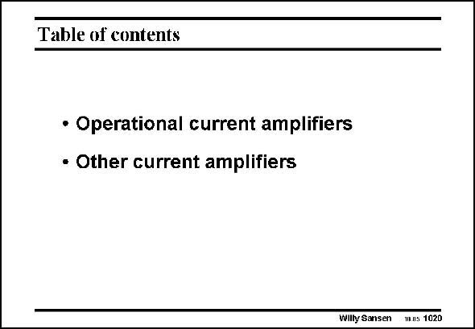

# SANSEN-1020 · Table of contents

章节：10 电流输入型运算放大器  
PDF 页：293；书本页：300；幻灯片编号：1020  
状态：unreviewed



## 对应教材讲解

### PDF 293 · 书本 300

In this Chapter, current amplifiers are shortly discussed and compared to voltage amplifiers. Current amplifiers provide higher-speed performance at the cost of higher equivalent input noise.

## 公式／性能结论候选摘录

以下为规则截取的原文，尚未逐项判读。

（未由规则找到；不代表原页没有此类内容。）

## 曲线结论候选摘录

以下为规则截取的原文，尚未逐项判读。

（未由规则找到；不代表原页没有此类内容。）

## 原文条件与近似候选摘录

以下为规则截取的原文，尚未逐项判读。

（未由规则找到；不代表原页没有此类内容。）

## 幻灯片 OCR（未校正）

```text
Table of contents
• Operational current amplifiers
• Other current amplifiers
Wilty Sansen
mns 1020
```

数学上下标、分数及正负号以原图为准。电路图已保留；未核对的连接不输出成可仿真 netlist。
