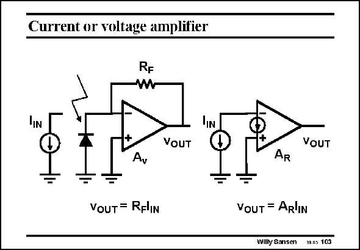

# SANSEN-103 · Current or voltage amplifier

章节：10 电流输入型运算放大器  
PDF 页：285；书本页：292；幻灯片编号：103  
状态：unreviewed



## 对应教材讲解

### PDF 285 · 书本 292

Current amplifiers are used for current sensors and for some high-frequency applications. For example a photodiode (pixel detector, radiation detector, ...) which receives light, provides a current proportional to this amount of light, provided it is reverse biased. It behaves as a current source with value I . IN In this case a voltage amplifier can be used with resistive feedback, which provides an output voltage R I , or a current-input amplifier with transresistance A . F IN R The question is, which one is better, from the point of view of gain (or sensitivity), speed and noise performance?

## 公式／性能结论候选摘录

以下为规则截取的原文，尚未逐项判读。

- PDF 285: For example a photodiode (pixel detector, radiation detector, ...) which receives light, provides a current proportional to this amount of light, provided it is reverse biased.
- PDF 285: F IN R The question is, which one is better, from the point of view of gain (or sensitivity), speed and noise performance?

## 曲线结论候选摘录

以下为规则截取的原文，尚未逐项判读。

（未由规则找到；不代表原页没有此类内容。）

## 原文条件与近似候选摘录

以下为规则截取的原文，尚未逐项判读。

- PDF 285: For example a photodiode (pixel detector, radiation detector, ...) which receives light, provides a current proportional to this amount of light, provided it is reverse biased.

## 幻灯片 OCR（未校正）

```text
Current or voltage amplifier
RF
VOUT
VOUT
Ay
AR
VoUT = RFliN
VOUT = AR'IN
Willy Sansen Ins 103
```

数学上下标、分数及正负号以原图为准。电路图已保留；未核对的连接不输出成可仿真 netlist。
