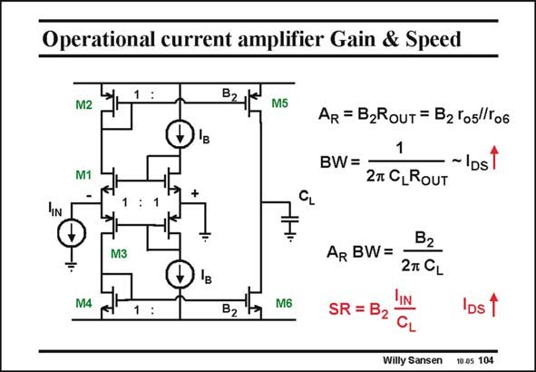

# SANSEN-104 · Operational current amplifier Gain & Speed

章节：10 电流输入型运算放大器  
PDF 页：285；书本页：292；幻灯片编号：104  
状态：unreviewed



## 对应教材讲解

### PDF 285 · 书本 292

A current input assumes the use of cascodes, as shown in this slide. This amplifier actually consists of two current mirrors, connected by their reference voltages. The outputs are then current mirrored to the output, with current factor B . 2 These two current mirrors provide the biasing. Both transistors M1 and M3 are biased at current I . B However, for small-signals, transistors M1 and M3 operate as cascodes. The input current i is divided over both input cascodes, multiplied by B , IN 2 and generates an output voltage in the output resistance R at the Drains of output transistors OUT M5 and M6. The current gain is very modest but the transresistance can be very large, especially if cascodes are used on transistors M5/M6 and gain boosting on these cascodes. The bandwidth BW is determined by R as well. As a result, the transresistance-bandwidth OUT product does not contain R any more. OUT It is not possible to compare the product A BW to the GBW of a voltage amplifier. They R have totally different dimensions!

### PDF 286 · 书本 293

The main advantage of this amplifier is that the Slew-Rate is unlimited. Indeed, for a large input current, the SR is determined by this input current itself, multiplied by B2.

## 公式／性能结论候选摘录

以下为规则截取的原文，尚未逐项判读。

- PDF 285: The current gain is very modest but the transresistance can be very large, especially if cascodes are used on transistors M5/M6 and gain boosting on these cascodes.
- PDF 285: The bandwidth BW is determined by R as well.
- PDF 285: As a result, the transresistance-bandwidth OUT product does not contain R any more.

## 曲线结论候选摘录

以下为规则截取的原文，尚未逐项判读。

（未由规则找到；不代表原页没有此类内容。）

## 原文条件与近似候选摘录

以下为规则截取的原文，尚未逐项判读。

- PDF 285: A current input assumes the use of cascodes, as shown in this slide.

## 幻灯片 OCR（未校正）

```text
Operational current amplifier Gain & Speed
M2
M5
M1I
AR = B2RouT = B2 Yosl/Го6
BW =
27 CLROUT
~ IDs
+
CL
M3
AR BW=
B2
27 CL
M4
B2
M6
SR = B2
Ds
Willy Sansen
10.05 104
```

数学上下标、分数及正负号以原图为准。电路图已保留；未核对的连接不输出成可仿真 netlist。
