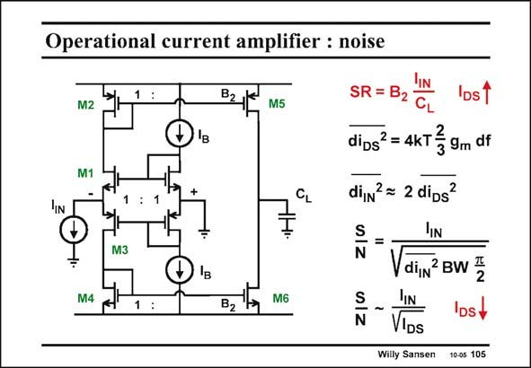

# SANSEN-105 · Operational current amplifier : noise

章节：10 电流输入型运算放大器  
PDF 页：286；书本页：293；幻灯片编号：105  
状态：unreviewed



## 对应教材讲解

### PDF 286 · 书本 293

This large input current can be larger than the biasing current I . In this case, tran- B sistor M1 carries a large current and transistor M3 goes off. Transistor M1 operates in class-AB! The Slew-Rate is then very high, at the price of some distortion! If we do not want this distortion, we have to choose a biasing current I , which is B always larger than the peak signal current i . IN High-speed generally leads to bad noise performance! This also applies to this current-input amplifier. A detailed analysis (on the next slide) shows that the noise of a cascode is always negligible, provided it is not driven by a voltage source and it does not have a low resistive load. This is exactly what we have here. Cascode transistor M1 sees 1/g as a source resistance and has 1/g as a load. The output m3 m2 noise current of M1 flows unattenuated through both M2 and M3. Fortunately, they cancel out at the output. However, the noise current powers of M2 and M4 themselves add up. Together they make up the total equivalent input noise current. The SNR is then easily calculated. The larger we take I , the worse the SNR becomes! B Indeed, higher speed leads to more noise!

## 公式／性能结论候选摘录

以下为规则截取的原文，尚未逐项判读。

（未由规则找到；不代表原页没有此类内容。）

## 曲线结论候选摘录

以下为规则截取的原文，尚未逐项判读。

- PDF 286: If we do not want this distortion, we have to choose a biasing current I , which is B always larger than the peak signal current i .

## 原文条件与近似候选摘录

以下为规则截取的原文，尚未逐项判读。

- PDF 286: A detailed analysis (on the next slide) shows that the noise of a cascode is always negligible, provided it is not driven by a voltage source and it does not have a low resistive load.

## 幻灯片 OCR（未校正）

```text
Operational current amplifier : noise
IN
M2
M1
M4
M3
B2
B2
M5
M6
lIN
SR = B2
IDs1
CL
dipsª = 4kT } 9m df
di,n? = 2 dips
S
N
IIN
din BW E
IDS+
N
DS
Willy Sansen
10-05 105
```

数学上下标、分数及正负号以原图为准。电路图已保留；未核对的连接不输出成可仿真 netlist。
