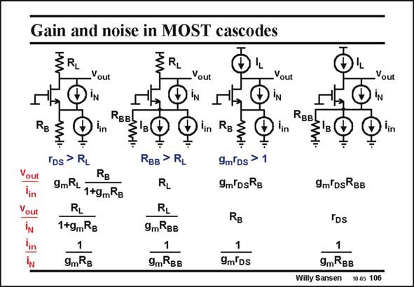

# SANSEN-106 · Gain and noise in MOST cascodes

章节：10 电流输入型运算放大器  
PDF 页：286；书本页：293；幻灯片编号：106  
状态：unreviewed



## 对应教材讲解

### PDF 286 · 书本 293

For a MOST cascode, the contributions of the input current i and of the transisin tor current noise source i N are compared. Both are calculated to the output. Finally, the ratio of input noise to the transistor noise current i /i is calculated. in N This shows what the equivalent input noise current is as a result of the transistor noise, which is the same in all cases, and which is proportional to g . m

### PDF 287 · 书本 294

Four cases can be distinguished depending on whether the cascode has a real current drive (cases 2 and 4). Resistance R is then the output resistance of the input current source i . It is BB in larger than R unless R is substituted by a current source I . L L L When the cascode is driven by a low resistance R , it acts rather as a voltage source. Again, B the load can be a small resistor R or large, as a current source I . L L It is clear that the contribution of the transistor noise to the input current is always small, except when the cascode is voltage driven (or driven with another 1/g ) and at the same time, m a small load resistor is used, or the input 1/g of a current mirror. m There is one single condition where the noise of a cascode is important. In all other cases it is negligible.

## 公式／性能结论候选摘录

以下为规则截取的原文，尚未逐项判读。

- PDF 286: Finally, the ratio of input noise to the transistor noise current i /i is calculated. in N This shows what the equivalent input noise current is as a result of the transistor noise, which is the same in all cases, and which is proportional to g . m
- PDF 287: Four cases can be distinguished depending on whether the cascode has a real current drive (cases 2 and 4).

## 曲线结论候选摘录

以下为规则截取的原文，尚未逐项判读。

（未由规则找到；不代表原页没有此类内容。）

## 原文条件与近似候选摘录

以下为规则截取的原文，尚未逐项判读。

（未由规则找到；不代表原页没有此类内容。）

## 幻灯片 OCR（未校正）

```text
Gain and noise in MOST cascodes
RB
Vout
Tin
Vout
_Yout
In
RBB!
lin
'Ds > RL
RB
9mRL
1+9mRB
RL
1+gmRg
9mRB
Vout
IN
Vout
OiN
'in
RBB
Yout
Đ
IN
'in
RBB> RL
RL
RL
9mRBB
9mRgB
Rg
9m'Ds > 1
9m DsRg
RB
1
9m Ds
9m DsRBB
TDs
1
9mRBB
Willy Sansen
10 05 106
```

数学上下标、分数及正负号以原图为准。电路图已保留；未核对的连接不输出成可仿真 netlist。
