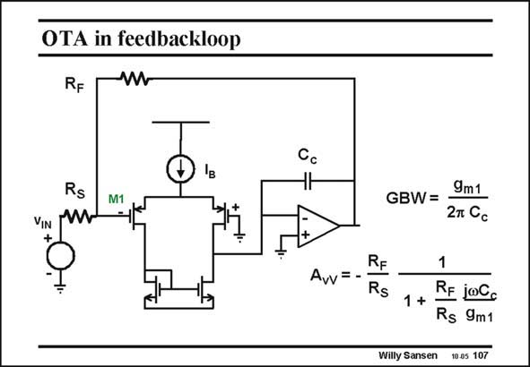

# SANSEN-107 · OTA in feedbackloop

章节：10 电流输入型运算放大器  
PDF 页：287；书本页：294；幻灯片编号：107  
状态：unreviewed



## 对应教材讲解

### PDF 287 · 书本 294

Another way to explore the high-speed capabilities of a current opamp is to close the feedback loop. A two-stage voltage opamp is sketched in this slide, in which the loop is closed by means of two resistors R and R . They S F define the gain R /R , and F S also the bandwidth. Indeed, a voltage opamp exchanges bandwidth for gain. It has a constant GBW, as is clearly shown by the expressions.

## 公式／性能结论候选摘录

以下为规则截取的原文，尚未逐项判读。

- PDF 287: They S F define the gain R /R , and F S also the bandwidth.
- PDF 287: Indeed, a voltage opamp exchanges bandwidth for gain.

## 曲线结论候选摘录

以下为规则截取的原文，尚未逐项判读。

（未由规则找到；不代表原页没有此类内容。）

## 原文条件与近似候选摘录

以下为规则截取的原文，尚未逐项判读。

（未由规则找到；不代表原页没有此类内容。）

## 幻灯片 OCR（未校正）

```text
OTA in feedbackloop
RF
W
Rs
VIn w
M1
GBW=
9m1
27 Cc
RE
Avv=-
Rs
1
1 +
RE joCo
Rs 9m1
Willy Sansen 10.05 107
```

数学上下标、分数及正负号以原图为准。电路图已保留；未核对的连接不输出成可仿真 netlist。
