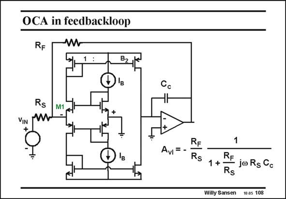

# SANSEN-108 · OCA in feedbackloop

章节：10 电流输入型运算放大器  
PDF 页：287；书本页：294；幻灯片编号：108  
状态：unreviewed



## 对应教材讲解

### PDF 287 · 书本 294

A similar two-stage opamp is sketched in this slide, but with a current-input stage as a first stage rather than with a voltage-input stage. Again, the loop is closed by means of two resistors R S and R , which again define F the gain R /R . F S However, the bandwidth is now different. It seems to be determined by the series resistor R . This resistor con- S verts the input voltage into a current, as a result it appears in the expressions separately.

### PDF 288 · 书本 295

If we now keep this resistor R constant, and vary the feedback resistor R to set the gain, S F then we have exactly the same set of curves as for a voltage opamp. This is shown next.

## 公式／性能结论候选摘录

以下为规则截取的原文，尚未逐项判读。

- PDF 287: Again, the loop is closed by means of two resistors R S and R , which again define F the gain R /R .
- PDF 287: F S However, the bandwidth is now different.
- PDF 287: This resistor con- S verts the input voltage into a current, as a result it appears in the expressions separately.
- PDF 288: If we now keep this resistor R constant, and vary the feedback resistor R to set the gain, S F then we have exactly the same set of curves as for a voltage opamp.

## 曲线结论候选摘录

以下为规则截取的原文，尚未逐项判读。

- PDF 288: If we now keep this resistor R constant, and vary the feedback resistor R to set the gain, S F then we have exactly the same set of curves as for a voltage opamp.

## 原文条件与近似候选摘录

以下为规则截取的原文，尚未逐项判读。

（未由规则找到；不代表原页没有此类内容。）

## 幻灯片 OCR（未校正）

```text
OCA in feedbackloop
RF
W
B2
Cc
Rs
M1
VIN
AvI = -
RF
Rs
1
RF
joRs Cc
Rs
Willy Sansen 10.05 108
```

数学上下标、分数及正负号以原图为准。电路图已保留；未核对的连接不输出成可仿真 netlist。
