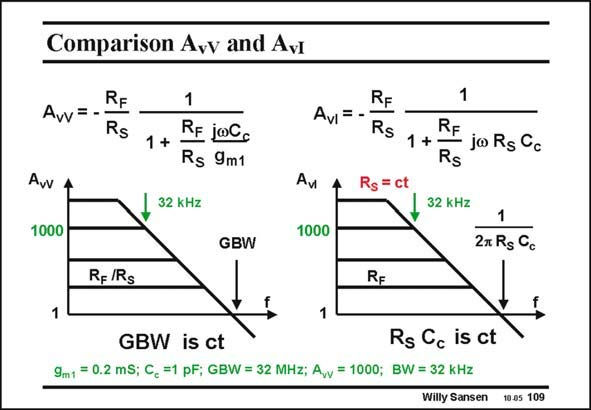

# SANSEN-109 · Comparison Avv and Avi

章节：10 电流输入型运算放大器  
PDF 页：288；书本页：295；幻灯片编号：109  
状态：unreviewed



## 对应教材讲解

### PDF 288 · 书本 295

On the left, a voltage opamp is shown with a gain of 1000. Its GBW is 32 MHz. On the right, a current opamp is shown, with the same gain. The input series resistor R is kept constant, S at a value of 5 kV. As a result, this current opamp has a GBW of 32 MHz. The exchange of gain and bandwidth is the same as for a voltage opamp. On the other hand, we can vary this resistor R to S set the gain. This is shown next.

## 公式／性能结论候选摘录

以下为规则截取的原文，尚未逐项判读。

- PDF 288: On the left, a voltage opamp is shown with a gain of 1000.
- PDF 288: On the right, a current opamp is shown, with the same gain.
- PDF 288: As a result, this current opamp has a GBW of 32 MHz.
- PDF 288: The exchange of gain and bandwidth is the same as for a voltage opamp.
- PDF 288: On the other hand, we can vary this resistor R to S set the gain.

## 曲线结论候选摘录

以下为规则截取的原文，尚未逐项判读。

（未由规则找到；不代表原页没有此类内容。）

## 原文条件与近似候选摘录

以下为规则截取的原文，尚未逐项判读。

（未由规则找到；不代表原页没有此类内容。）

## 幻灯片 OCR（未校正）

```text
Comparison Avv and Avi
Avv=
RF
Rs
Avv
1000
1
1 +
RE joC
Rs 9m1
32 kHz
Avi
RE
Rs
Rs
= ct
Av
1000
1
RF
1 +-
joRs Cc
Rs
32 KHz
GBW
1
2x Rg Cc
Rg/Rs
RE
1
GBW is ct
Rs Cc is ct
9m1 = 0.2 mS; C, =1 pF; GBW = 32 MHz; Awv = 1000; BW = 32 kHz
Willy Sansen
10 05 109
```

数学上下标、分数及正负号以原图为准。电路图已保留；未核对的连接不输出成可仿真 netlist。
