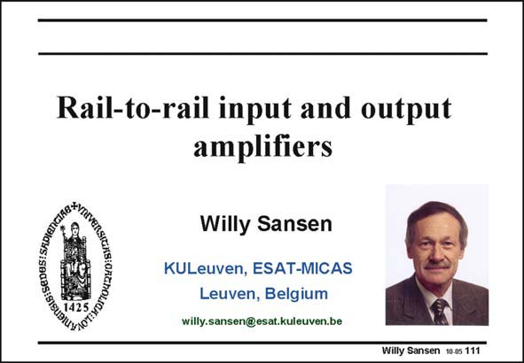

# SANSEN-111 · Slide 111

章节：11 轨到轨输入与输出放大器  
PDF 页：294；书本页：301；幻灯片编号：111  
状态：unreviewed



## 对应教材讲解

### PDF 294 · 书本 301

Rail-to-rail amplifiers are a special category of amplifiers. They can take input signal swings from the positive to the negative supply rail. Their common-mode input range extends from rail to rail. However, this is fairly easy to do at the output. This is quite complicated however at the input. In principle, only a folded cascode is capable of including a supply rail at the input. This will be the basis for allrail-to-rail input amplifiers. An alternative principle is to use depletion-mode nMOST devices. Leaving out an ion implant allows nMOST devices to obtain a negative threshold voltage. This allows rail-to-rail input stages with supply voltages down to 1 V. It is not considered any further however, as no standard CMOS can be used. Let us first decide when we need such an input. What are the circuit configurations which allow a rail-to-rail input range?

## 公式／性能结论候选摘录

以下为规则截取的原文，尚未逐项判读。

（未由规则找到；不代表原页没有此类内容。）

## 曲线结论候选摘录

以下为规则截取的原文，尚未逐项判读。

（未由规则找到；不代表原页没有此类内容。）

## 原文条件与近似候选摘录

以下为规则截取的原文，尚未逐项判读。

（未由规则找到；不代表原页没有此类内容。）

## 幻灯片 OCR（未校正）

```text
Rail-to-rail input and output
amplifiers
gIS:SEDES: SA0I0),
Willy Sansen
KULeuven, ESAT-MICAS
Leuven, Belgium
willy.sansen@esat.kuleuven.be
Willy Sansen 10-05 111
```

数学上下标、分数及正负号以原图为准。电路图已保留；未核对的连接不输出成可仿真 netlist。
