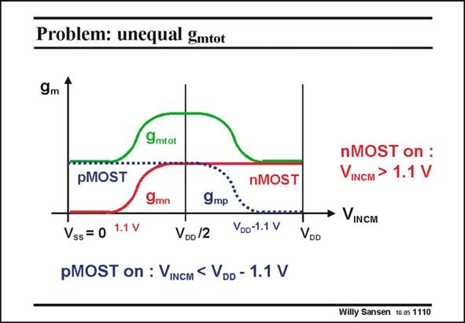

# SANSEN-1110 · Problem: unequal gmtot

章节：11 轨到轨输入与输出放大器  
PDF 页：298；书本页：305；幻灯片编号：1110  
状态：unreviewed



## 对应教材讲解

### PDF 298 · 书本 305

With a supply voltage of 2.5 V, there is a problem with the total transconductance and thus with the total GBW. For common-mode input voltages with V in the INCM middle (at half the supply voltage), both input pairs are operational. Their g ’s m are now added. Actually, the g is doubled, as normally m the nMOST transconductance equals the pMOST one. On both extremities however, only one pair is operational and the g is not doubled. It is therefore half of what is m obtained in the middle. The transconductances are sketched in this slide for each pair separately and also summed. It is clear that the pMOST g goes to zero when the common-mode input V reaches the m INCM positive supply voltage within 1.1 V. Also, at zero V , the nMOSTs are off and only start working once V is larger than INCM INCM approximately 1.1 V.

## 公式／性能结论候选摘录

以下为规则截取的原文，尚未逐项判读。

- PDF 298: With a supply voltage of 2.5 V, there is a problem with the total transconductance and thus with the total GBW.
- PDF 298: Actually, the g is doubled, as normally m the nMOST transconductance equals the pMOST one.
- PDF 298: It is therefore half of what is m obtained in the middle.

## 曲线结论候选摘录

以下为规则截取的原文，尚未逐项判读。

（未由规则找到；不代表原页没有此类内容。）

## 原文条件与近似候选摘录

以下为规则截取的原文，尚未逐项判读。

- PDF 298: Also, at zero V , the nMOSTs are off and only start working once V is larger than INCM INCM approximately 1.1 V.

## 幻灯片 OCR（未校正）

```text
Problem: unequal gmtot
9m 1
9mtot
pMOST
nMOST
9mn
9mр
Vss = 0
1.1 V
VDo /2
Voo-1.1 V
pMOST on : VINCM < VDD - 1.1 V
VDD
nMOST on :
VINCM > 1.1 V
• VINCM
Willy Sansen 10 0s 1110
```

数学上下标、分数及正负号以原图为准。电路图已保留；未核对的连接不输出成可仿真 netlist。
