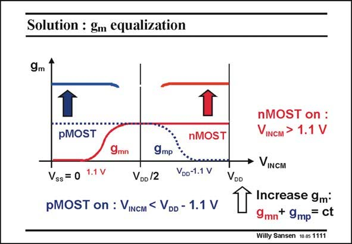

# SANSEN-1111 · Solution : gm equalization

章节：11 轨到轨输入与输出放大器  
PDF 页：299；书本页：306；幻灯片编号：1111  
状态：unreviewed



## 对应教材讲解

### PDF 299 · 书本 306

We cannot allow the total transconductance g to mtot change over a factor of two over the input commonmode range. This would give a large amount of distortion. In order to equalize the g , we must increase the mtot g of each pair by a facm tor of two at both ends. In general, we must find a way to make g or the sum of mtot the g ’s constant over the m whole common-mode range.

## 公式／性能结论候选摘录

以下为规则截取的原文，尚未逐项判读。

- PDF 299: In order to equalize the g , we must increase the mtot g of each pair by a facm tor of two at both ends.

## 曲线结论候选摘录

以下为规则截取的原文，尚未逐项判读。

（未由规则找到；不代表原页没有此类内容。）

## 原文条件与近似候选摘录

以下为规则截取的原文，尚未逐项判读。

（未由规则找到；不代表原页没有此类内容。）

## 幻灯片 OCR（未校正）

```text
Solution : gm equalization
9m
1
PMOST
1
nMOST
9mn
9mр
Vss = 0 1.1 V
VDo /2
VDo-1.1 V
pMOST on : VINCM < VDD - 1.1 V
VDD
nMOST on :
VINCM > 1.1 V
• VINCM
Increase 9m*
9mn+ 9mp= ct
Willy Sansen 10-05 1111
```

数学上下标、分数及正负号以原图为准。电路图已保留；未核对的连接不输出成可仿真 netlist。
