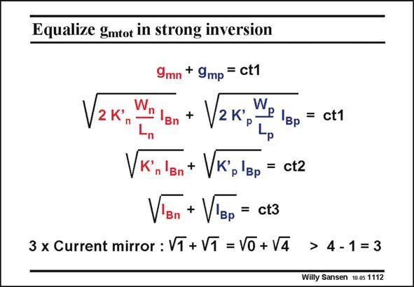

# SANSEN-1112 · Equalize gmtot in strong inversion

章节：11 轨到轨输入与输出放大器  
PDF 页：299；书本页：306；幻灯片编号：1112  
状态：unreviewed



## 对应教材讲解

### PDF 299 · 书本 306

How can we make the sum of the g ’s constant over the m whole common mode range? Substitution of the g ’s by m their expression with the current and W/L shows that we have to adjust the currents. The MOSTs are assumed to work in strong inversion. To double the g , we m must multiply the current by four. In other words, we must add three times more current to the existing current than we already had.

## 公式／性能结论候选摘录

以下为规则截取的原文，尚未逐项判读。

（未由规则找到；不代表原页没有此类内容。）

## 曲线结论候选摘录

以下为规则截取的原文，尚未逐项判读。

（未由规则找到；不代表原页没有此类内容。）

## 原文条件与近似候选摘录

以下为规则截取的原文，尚未逐项判读。

- PDF 299: The MOSTs are assumed to work in strong inversion.

## 幻灯片 OCR（未校正）

```text
Equalize gmtot in strong inversion
V21
9mn + 9mp = ct1
W,
2 K'р
P Iвp
= ct1
Vк'
Bn
+ VK'p'Bp = ct2
VIBn
+ V'Bр = ct3
3 x Current mirror : V1 + V1 = Vo + V4
> 4-1 = 3
Willy Sansen 10 0s 1112
```

数学上下标、分数及正负号以原图为准。电路图已保留；未核对的连接不输出成可仿真 netlist。
