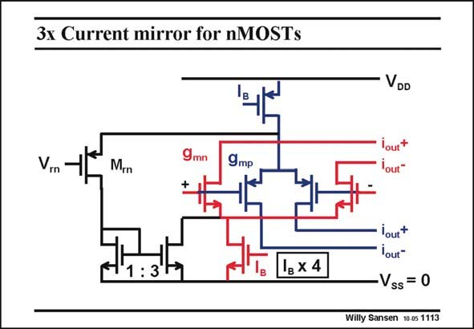

# SANSEN-1113 · 3x Current mirror for nMOSTs

章节：11 轨到轨输入与输出放大器  
PDF 页：300；书本页：307；幻灯片编号：1113  
状态：unreviewed



## 对应教材讲解

### PDF 300 · 书本 307

A circuit that is able to add three times more current to the existing current than already present, is shown in this slide. For a common-mode (or average) input voltage in the middle, both pairs are operational. The transistor M rn is then off. Its gate voltage V is too high compared to rn the common-mode input voltage. When the input voltages increase however, the pMOSTs turn off, and all current I flows through M to the 3× current mirror, which is then added to the current I B rn B of the nMOST current source. This current is thus multiplied by four. The nMOST transconductances are now doubled. The actual voltage at which the current is taken from the input pMOSTs towards M is rn reference voltage V . The transistor M now forms a differential pair with both input pMOSTs. rn rn When the common-mode input voltage is exactly V , half the current I flows through the rn B pMOSTs and the other half through the transistor M . When the average input voltage is rn higher than V , all the current flows through M . The input pMOSTs are now completely rn rn shut off. Note that reference voltage V must be about 1.1 V lower than the supply voltage if V is 0.7 V. rn T

## 公式／性能结论候选摘录

以下为规则截取的原文，尚未逐项判读。

- PDF 300: When the input voltages increase however, the pMOSTs turn off, and all current I flows through M to the 3× current mirror, which is then added to the current I B rn B of the nMOST current source.
- PDF 300: This current is thus multiplied by four.

## 曲线结论候选摘录

以下为规则截取的原文，尚未逐项判读。

（未由规则找到；不代表原页没有此类内容。）

## 原文条件与近似候选摘录

以下为规则截取的原文，尚未逐项判读。

（未由规则找到；不代表原页没有此类内容。）

## 幻灯片 OCR（未校正）

```text
3x Current mirror for nMOSTs
VDD
Vrn
Mrn
9mn
+
9mр
: 3
1 x 4
lout+
Yout"
Vss = 0
Willy Sansen 10.05 1113
```

数学上下标、分数及正负号以原图为准。电路图已保留；未核对的连接不输出成可仿真 netlist。
