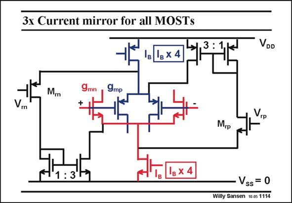

# SANSEN-1114 · 3x Current mirror for all MOSTs

章节：11 轨到轨输入与输出放大器  
PDF 页：300；书本页：307；幻灯片编号：1114  
状态：unreviewed



## 对应教材讲解

### PDF 300 · 书本 307

The same arrangement can be made for the nMOSTs. Another reference voltage V is now added, which is rp about 1.1 V. When the average input voltage is less than 1.1 V, all current I of the nMOST B current source is pulled through transistor M . It rp is then multiplied by three and added to the current already flowing through the pMOSTs. The current is multiplied by four and the transconductance by two (if they operate in strong inversion).

## 公式／性能结论候选摘录

以下为规则截取的原文，尚未逐项判读。

（未由规则找到；不代表原页没有此类内容。）

## 曲线结论候选摘录

以下为规则截取的原文，尚未逐项判读。

（未由规则找到；不代表原页没有此类内容。）

## 原文条件与近似候选摘录

以下为规则截取的原文，尚未逐项判读。

（未由规则找到；不代表原页没有此类内容。）

## 幻灯片 OCR（未校正）

```text
3x Current mirror for all MOSTs
в 1e x 4
VDD
M.
V
9mn
+
9mр
rp
M.p
Ig x 4
Vss = 0
Willy Sansen 10.05 1114
```

数学上下标、分数及正负号以原图为准。电路图已保留；未核对的连接不输出成可仿真 netlist。
