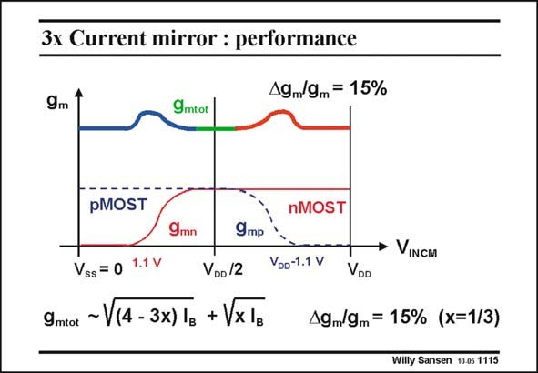

# SANSEN-1115 · 3x Current mirror : performance

章节：11 轨到轨输入与输出放大器  
PDF 页：301；书本页：308；幻灯片编号：1115  
状态：unreviewed



## 对应教材讲解

### PDF 301 · 书本 308

The transconductance is then effectively equalized over the whole commonmode input range. During the transitions however, the sum of the g ’s is not conm stant. They show an error of about 15%. An approximate expression of the actual g is mtot given. It is derived from the simple square-law models of a MOST. An error of 15% may not sound too bad. It all depends on the application. However, We will see later in a comparative table (last slide), that this is the worst of all.

## 公式／性能结论候选摘录

以下为规则截取的原文，尚未逐项判读。

- PDF 301: The transconductance is then effectively equalized over the whole commonmode input range.
- PDF 301: It all depends on the application.

## 曲线结论候选摘录

以下为规则截取的原文，尚未逐项判读。

（未由规则找到；不代表原页没有此类内容。）

## 原文条件与近似候选摘录

以下为规则截取的原文，尚未逐项判读。

- PDF 301: An approximate expression of the actual g is mtot given.

## 幻灯片 OCR（未校正）

```text
3x Current mirror : performance
9m
19/9m= 15%
9mtot
pMOST
nMOST
9mn
9mр
• VINCM
Vss = 0 1.1 V
VDD /2
9mtot
~ V(4 - 3x) 1g + VxIB
VDo-1.1 V
VOD
19m/9m= 15% (x=1/3)
Willy Sansen 10 0s 1115
```

数学上下标、分数及正负号以原图为准。电路图已保留；未核对的连接不输出成可仿真 netlist。
