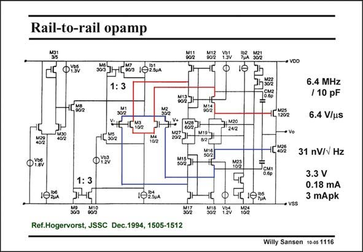

# SANSEN-1116 · Rail-to-rail opamp

章节：11 轨到轨输入与输出放大器  
PDF 页：301；书本页：308；幻灯片编号：1116  
状态：unreviewed



## 对应教材讲解

### PDF 301 · 书本 308

A realization which has used this g equalization is m shown in this slide. The two input cascodes in parallel are easily found. The output transistors act as a second stage. Miller capacitances are therefore necessary. They go through cascodes to avoid positive zero’s. Some specifications are also listed. The 3× current mirrors are easily identified as well.

## 公式／性能结论候选摘录

以下为规则截取的原文，尚未逐项判读。

- PDF 301: A realization which has used this g equalization is m shown in this slide.
- PDF 301: Miller capacitances are therefore necessary.

## 曲线结论候选摘录

以下为规则截取的原文，尚未逐项判读。

（未由规则找到；不代表原页没有此类内容。）

## 原文条件与近似候选摘录

以下为规则截取的原文，尚未逐项判读。

（未由规则找到；不代表原页没有此类内容。）

## 幻灯片 OCR（未校正）

```text
Rail-to-rail opamp
HZ VH TIA 332
1:3
15002
002
V42-10192
JH
71220
7 Sả2
"aR
4L1202
→ Vo
6.4 MHz
/10 pF
6.4 V/us
402
O18v
102u
012v
1:3
1025u4
Ref.Hogervorst, JSSC Dec.1994, 1505-1512
5022
8?"
31 nV/V Hz
3.3 V
0.18 mA
3 mApk
• VSS
302 M12 V26 M22
Willy Sansen 10-05 1116
```

数学上下标、分数及正负号以原图为准。电路图已保留；未核对的连接不输出成可仿真 netlist。
