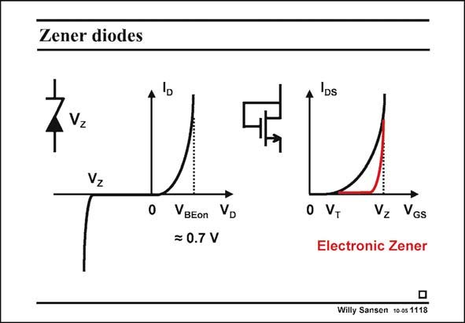

# SANSEN-1118 · Zener diodes

章节：11 轨到轨输入与输出放大器  
PDF 页：302；书本页：309；幻灯片编号：1118  
状态：unreviewed



## 对应教材讲解

### PDF 302 · 书本 309

A Zener diode actually provides a more sharp breakdown at V . A MOST does Z not provide the same sharpness. The addition of a few MOSTs can sharpen the corner somewhat. It is then called an electronic Zener diode.

## 公式／性能结论候选摘录

以下为规则截取的原文，尚未逐项判读。

（未由规则找到；不代表原页没有此类内容。）

## 曲线结论候选摘录

以下为规则截取的原文，尚未逐项判读。

（未由规则找到；不代表原页没有此类内容。）

## 原文条件与近似候选摘录

以下为规则截取的原文，尚未逐项判读。

（未由规则找到；不代表原页没有此类内容。）

## 幻灯片 OCR（未校正）

```text
Zener diodes
Zvz
VBEon Vo
= 0.7 V
A DS
0 VT
Vz VGs
Electronic Zener
Willy Sansen 10 0s 1118
```

数学上下标、分数及正负号以原图为准。电路图已保留；未核对的连接不输出成可仿真 netlist。
