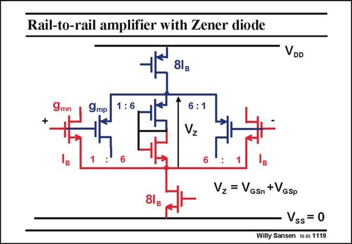

# SANSEN-1119 · Rail-to-rail amplifier with Zener diode

章节：11 轨到轨输入与输出放大器  
PDF 页：303；书本页：310；幻灯片编号：1119  
状态：unreviewed



## 对应教材讲解

### PDF 303 · 书本 310

The principle is shown in this slide. For input common-mode voltages in the middle, all transistors are on. The two diode connected MOSTs in the middle conduct as well. Because they are 6× larger, they take six times more current. The total current in either current source is now 8I , where I is the current B B in each input transistor. Let us call the voltage across the two diodes V . It Z is two times their V . GS When the average input voltage goes up, the pMOSTs drop out, as shown next.

## 公式／性能结论候选摘录

以下为规则截取的原文，尚未逐项判读。

（未由规则找到；不代表原页没有此类内容。）

## 曲线结论候选摘录

以下为规则截取的原文，尚未逐项判读。

（未由规则找到；不代表原页没有此类内容。）

## 原文条件与近似候选摘录

以下为规则截取的原文，尚未逐项判读。

（未由规则找到；不代表原页没有此类内容。）

## 幻灯片 OCR（未校正）

```text
Rail-to-rail amplifier with Zener diode
8lg
VDD
9mp
: 6
6:1
Vz
Vz = VGsn +VGsp
Vss= 0
Willy Sansen 10.05 1119
```

数学上下标、分数及正负号以原图为准。电路图已保留；未核对的连接不输出成可仿真 netlist。
