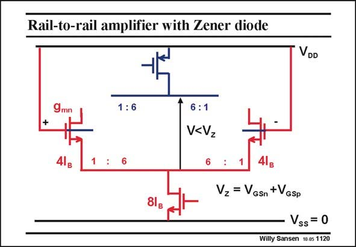

# SANSEN-1120 · Rail-to-rail amplifier with Zener diode

章节：11 轨到轨输入与输出放大器  
PDF 页：303；书本页：310；幻灯片编号：1120  
状态：unreviewed



## 对应教材讲解

### PDF 303 · 书本 310

When the average input voltage goes up, for example, up to the supply voltage, the pMOSTs drop out. Indeed, the voltage across the two diodes has dropped to below the V voltage and Z drops out. They are omitted from the figure in this slide. As a consequence, all the current 8I has to flow in B the two nMOST transistors. They both carry a current of 4I , which is four B times larger than before. Their transconductance now doubles.

## 公式／性能结论候选摘录

以下为规则截取的原文，尚未逐项判读。

（未由规则找到；不代表原页没有此类内容。）

## 曲线结论候选摘录

以下为规则截取的原文，尚未逐项判读。

（未由规则找到；不代表原页没有此类内容。）

## 原文条件与近似候选摘录

以下为规则截取的原文，尚未逐项判读。

（未由规则找到；不代表原页没有此类内容。）

## 幻灯片 OCR（未校正）

```text
Rail-to-rail amplifier with Zener diode
VDD
1:6
6:1
V<Vz
Vz = VGsn +VGsp
Vss= 0
Willy Sansen 10.05 1120
```

数学上下标、分数及正负号以原图为准。电路图已保留；未核对的连接不输出成可仿真 netlist。
