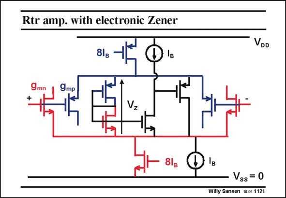

# SANSEN-1121 · Rtr amp. with electronic Zener

章节：11 轨到轨输入与输出放大器  
PDF 页：304；书本页：311；幻灯片编号：1121  
状态：unreviewed



## 对应教材讲解

### PDF 304 · 书本 311

A much better behavior is achieved by taking an electronic Zener. For this purpose, an amplifier is added in parallel with the nMOST Zener diode followed by a source follower. The transitions are now much better defined. This means that the error in transconductance over the common-mode input range is smaller.

## 公式／性能结论候选摘录

以下为规则截取的原文，尚未逐项判读。

（未由规则找到；不代表原页没有此类内容。）

## 曲线结论候选摘录

以下为规则截取的原文，尚未逐项判读。

（未由规则找到；不代表原页没有此类内容。）

## 原文条件与近似候选摘录

以下为规则截取的原文，尚未逐项判读。

（未由规则找到；不代表原页没有此类内容。）

## 幻灯片 OCR（未校正）

```text
Rtr amp. with electronic Zener
8lg
Iв
VDD
9mp
Vz
Vss = 0
Willy Sansen 10 os 1121
```

数学上下标、分数及正负号以原图为准。电路图已保留；未核对的连接不输出成可仿真 netlist。
