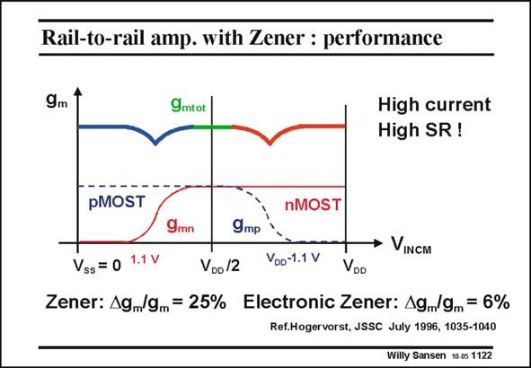

# SANSEN-1122 · Rail-to-rail amp. with Zener : performance

章节：11 轨到轨输入与输出放大器  
PDF 页：304；书本页：311；幻灯片编号：1122  
状态：unreviewed



## 对应教材讲解

### PDF 304 · 书本 311

However, the error in transconductance is only 6% in contrast with 25% without the amplifier. The larger current in the input devices leads to a larger Slew Rate, which is a considerable additional advantage.

## 公式／性能结论候选摘录

以下为规则截取的原文，尚未逐项判读。

（未由规则找到；不代表原页没有此类内容。）

## 曲线结论候选摘录

以下为规则截取的原文，尚未逐项判读。

（未由规则找到；不代表原页没有此类内容。）

## 原文条件与近似候选摘录

以下为规则截取的原文，尚未逐项判读。

（未由规则找到；不代表原页没有此类内容。）

## 幻灯片 OCR（未校正）

```text
Rail-to-rail amp. with Zener : performance
9m
9mtot
High current
High SR!
pMOST
nMOST
9mn
9mр
• VINCM
Vss = 0 1.1 V
VDo /2
VDo-1.1 V
VOD
Zener: A9,/9m = 25% Electronic Zener: A9/9m = 6%
Ref.Hogervorst, JSSC July 1996, 1035-1040
Willy Sansen 10-05 1122
```

数学上下标、分数及正负号以原图为准。电路图已保留；未核对的连接不输出成可仿真 netlist。
