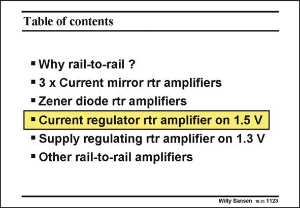

# SANSEN-1123 · Table of contents

章节：11 轨到轨输入与输出放大器  
PDF 页：305；书本页：312；幻灯片编号：1123  
状态：unreviewed



## 对应教材讲解

### PDF 305 · 书本 312

The configurations in this slide exploit the square-law relationship of a MOST in strong inversion, to extract a doubling of the transconductance as a result of a multiplication of the current by four. At lower currents, and at lower frequencies, weak inversion can be used. In this case, the transconductance is proportional to the current and current feedback loops can be used to equalize the transconductance.

## 公式／性能结论候选摘录

以下为规则截取的原文，尚未逐项判读。

- PDF 305: The configurations in this slide exploit the square-law relationship of a MOST in strong inversion, to extract a doubling of the transconductance as a result of a multiplication of the current by four.
- PDF 305: In this case, the transconductance is proportional to the current and current feedback loops can be used to equalize the transconductance.

## 曲线结论候选摘录

以下为规则截取的原文，尚未逐项判读。

（未由规则找到；不代表原页没有此类内容。）

## 原文条件与近似候选摘录

以下为规则截取的原文，尚未逐项判读。

（未由规则找到；不代表原页没有此类内容。）

## 幻灯片 OCR（未校正）

```text
Table of contents
• Why rail-to-rail ?
• 3 x Current mirror rtr amplifiers
• Zener diode rtr amplifiers
• Current regulator rtr amplifier on 1.5 V
" Supply regulating rtr amplifier on 1.3 V
* Other rail-to-rail amplifiers
Willy Sansen 10.05 1123
```

数学上下标、分数及正负号以原图为准。电路图已保留；未核对的连接不输出成可仿真 netlist。
