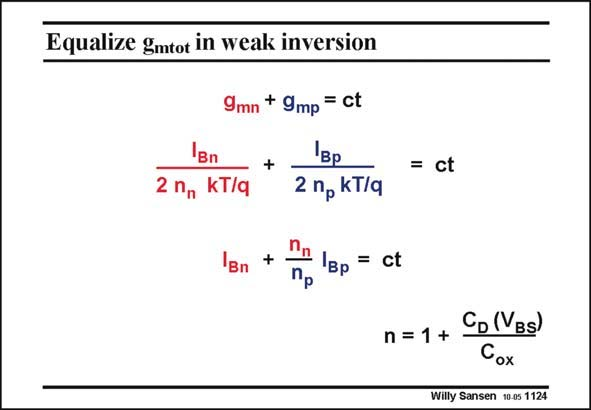

# SANSEN-1124 · Equalize gmtot in weak inversion

章节：11 轨到轨输入与输出放大器  
PDF 页：305；书本页：312；幻灯片编号：1124  
状态：unreviewed



## 对应教材讲解

### PDF 305 · 书本 312

In weak inversion, the transconductance is proportional to the current. Maintaining a constant current over the whole common-mode input range will provide a constant total transconductance. There is one problem however. The factor n is different for nMOST and pMOST devices. Remember that this n factor is not very precise because it contains the depletion layer capacitance, which depends on biasing voltages. Nevertheless, it is vital to try to compensate for this difference in the n factor. An error in transconductance will otherwise result.

## 公式／性能结论候选摘录

以下为规则截取的原文，尚未逐项判读。

- PDF 305: In weak inversion, the transconductance is proportional to the current.
- PDF 305: Remember that this n factor is not very precise because it contains the depletion layer capacitance, which depends on biasing voltages.

## 曲线结论候选摘录

以下为规则截取的原文，尚未逐项判读。

（未由规则找到；不代表原页没有此类内容。）

## 原文条件与近似候选摘录

以下为规则截取的原文，尚未逐项判读。

（未由规则找到；不代表原页没有此类内容。）

## 幻灯片 OCR（未校正）

```text
Equalize gmtot in weak inversion
Bn
2 nn KT/q
9mn + 9mp = ct
+
Bp
2 nр KT/q
Bn
+
= ct
= ct
Пр
n = 1+
D(Bs)
Cox
Willy Sansen 10.05 1124
```

数学上下标、分数及正负号以原图为准。电路图已保留；未核对的连接不输出成可仿真 netlist。
