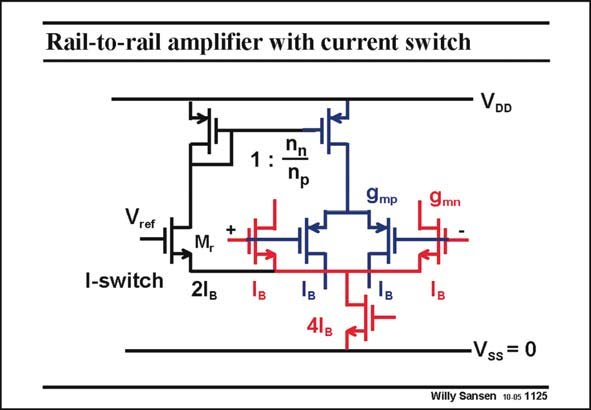

# SANSEN-1125 · Rail-to-rail amplifier with current switch

章节：11 轨到轨输入与输出放大器  
PDF 页：306；书本页：313；幻灯片编号：1125  
状态：unreviewed



## 对应教材讲解

### PDF 306 · 书本 313

A possible realization is shown in this slide. It only works for low average input voltages. For input voltages close to V , all four input ref MOSTs carry about the same current I . Transistor B M takes about half the r current 2I of the current B source with current 4I . B Transistor M therefore acts r as a kind of current switch. For lower input voltages, the input nMOSTs are off and all the current 4I flows B through transistor M . As a result, the pMOST input devices carry a current 2I . Their current r B is doubled and so is their transconductance. For high input voltages, the pMOSTs are off. The input nMOSTs then draw all the current 4I . The current and the transconductance of the input nMOSTs is doubled. B The top pMOST current mirror is used to provide some compensation for the difference in n factor.

## 公式／性能结论候选摘录

以下为规则截取的原文，尚未逐项判读。

- PDF 306: B Transistor M therefore acts r as a kind of current switch.
- PDF 306: As a result, the pMOST input devices carry a current 2I .

## 曲线结论候选摘录

以下为规则截取的原文，尚未逐项判读。

（未由规则找到；不代表原页没有此类内容。）

## 原文条件与近似候选摘录

以下为规则截取的原文，尚未逐项判读。

（未由规则找到；不代表原页没有此类内容。）

## 幻灯片 OCR（未校正）

```text
Rail-to-rail amplifier with current switch
VDD
1:
Пр
Vref
I-switch
9 mр
+1
M,
2lg
Vss = 0
Willy Sansen 10-05 1125
```

数学上下标、分数及正负号以原图为准。电路图已保留；未核对的连接不输出成可仿真 netlist。
