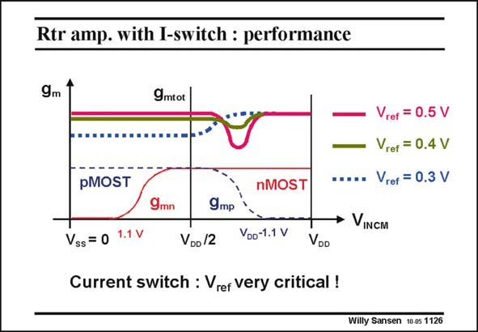

# SANSEN-1126 · Rtr amp. with I-switch : performance

章节：11 轨到轨输入与输出放大器  
PDF 页：306；书本页：313；幻灯片编号：1126  
状态：unreviewed



## 对应教材讲解

### PDF 306 · 书本 313

However, the design of this rail-to-rail input stage is not obvious. The choice of the reference voltage V is ref rather critical. This is shown in this slide. Exact equalization of g m is a real compromise indeed.

## 公式／性能结论候选摘录

以下为规则截取的原文，尚未逐项判读。

- PDF 306: Exact equalization of g m is a real compromise indeed.

## 曲线结论候选摘录

以下为规则截取的原文，尚未逐项判读。

（未由规则找到；不代表原页没有此类内容。）

## 原文条件与近似候选摘录

以下为规则截取的原文，尚未逐项判读。

（未由规则找到；不代表原页没有此类内容。）

## 幻灯片 OCR（未校正）

```text
Rtr amp. with I-switch : performance
9m 1
9mtot
pMOST
nMOST
9mn
9mр
ref
= 0.5 V
Vrer = 0.4 V
Vrer = 0.3 V
• VINCM
Vss = 0
1.1 V
VDo /2
Voo-1.1 V
VOD
Current switch : Vrer very critical !
Willy Sansen 10 0s 1126
```

数学上下标、分数及正负号以原图为准。电路图已保留；未核对的连接不输出成可仿真 netlist。
