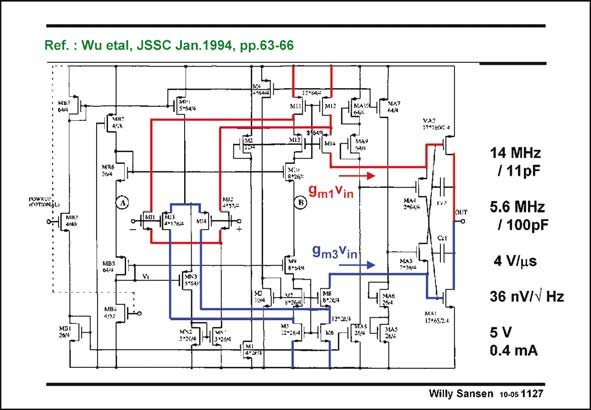

# SANSEN-1127 · Ref. : Wu etal, JSSC Jan.1994, pp.63-66

章节：11 轨到轨输入与输出放大器  
PDF 页：307；书本页：314；幻灯片编号：1127  
状态：unreviewed



## 对应教材讲解

### PDF 307 · 书本 314

An example of this kind of g equalization is shown in m this slide. This opamp has rail-to-rail input and output. So it can be used as a buffer. The opamp itself has a double folded cascode as a first stage and two output transistors as a second stage. Miller capacitances are now required. They do not go through cascodes however, possibly leading to problems with positive zero’s. Some specifications are added. The g equalization circuitry is highlighted on the next slide. m

## 公式／性能结论候选摘录

以下为规则截取的原文，尚未逐项判读。

- PDF 307: An example of this kind of g equalization is shown in m this slide.
- PDF 307: The g equalization circuitry is highlighted on the next slide. m

## 曲线结论候选摘录

以下为规则截取的原文，尚未逐项判读。

（未由规则找到；不代表原页没有此类内容。）

## 原文条件与近似候选摘录

以下为规则截取的原文，尚未逐项判读。

（未由规则找到；不代表原页没有此类内容。）

## 幻灯片 OCR（未校正）

```text
Ref. : Wu etal, JSSC Jan.1994, pp.63-66
9m1 Vin
9m3Vin
14 MHz
/11pF
5.6 MHz
/ 100pF
4 V/us
36 nV/v Hz
5 V
0.4 mA
Willy Sansen 10-05 1127
```

数学上下标、分数及正负号以原图为准。电路图已保留；未核对的连接不输出成可仿真 netlist。
