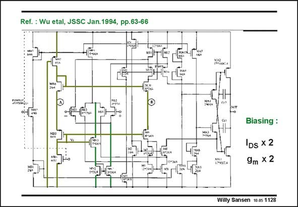

# SANSEN-1128 · Ref. : Wu etal, JSSC Jan.1994, pp.63-66

章节：11 轨到轨输入与输出放大器  
PDF 页：307；书本页：314；幻灯片编号：1128  
状态：unreviewed



## 对应教材讲解

### PDF 307 · 书本 314

The reference voltage V is ref generated at the Drain/Gate of transistor MB5. The current-switch transistor is MN3. Its current determines the current in the nMOST transistor pair through current mirror MN1/MN2. In order to see how this circuit is working, it is repeated on the next slide. It is already clear that the current in one pair will double when the other one is off. As a result, the transconductance will double as well.

## 公式／性能结论候选摘录

以下为规则截取的原文，尚未逐项判读。

- PDF 307: As a result, the transconductance will double as well.

## 曲线结论候选摘录

以下为规则截取的原文，尚未逐项判读。

（未由规则找到；不代表原页没有此类内容。）

## 原文条件与近似候选摘录

以下为规则截取的原文，尚未逐项判读。

（未由规则找到；不代表原页没有此类内容。）

## 幻灯片 OCR（未校正）

```text
Ref. : Wu etal, JSSC Jan.1994, pp.63-66
Biasing :
IDs x 2
9m x 2
Willy Sansen 10-05 1128
```

数学上下标、分数及正负号以原图为准。电路图已保留；未核对的连接不输出成可仿真 netlist。
