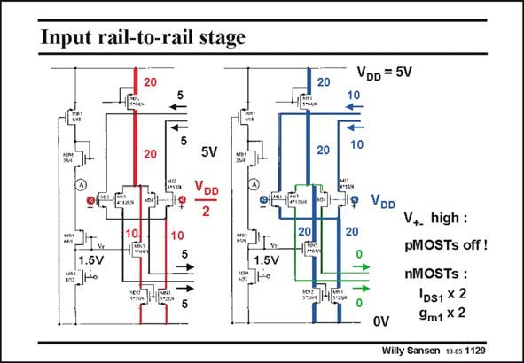

# SANSEN-1129 · Input rail-to-rail stage VDD = 5V

章节：11 轨到轨输入与输出放大器  
PDF 页：308；书本页：315；幻灯片编号：1129  
状态：unreviewed



## 对应教材讲解

### PDF 308 · 书本 315

The input stage is shown twice, once with the inputs halfway at the supply voltage and once with the inputs at the supply voltage. In the first case, all four input transistors carry approximately equal currents (about 5 mA). The thickness of the line corresponds to the size of the current. Note that the top current source has a fixed current. All other currents change with the average input voltage. For a high input voltage, the pMOSTs go off. The full current is now available to the nMOST devices. Their current doubles and so does their transconductance, providing that they operate in weak inversion. Large devices are used for small currents. The transistors operate in weak inversion indeed.

## 公式／性能结论候选摘录

以下为规则截取的原文，尚未逐项判读。

- PDF 308: In the first case, all four input transistors carry approximately equal currents (about 5 mA).

## 曲线结论候选摘录

以下为规则截取的原文，尚未逐项判读。

（未由规则找到；不代表原页没有此类内容。）

## 原文条件与近似候选摘录

以下为规则截取的原文，尚未逐项判读。

- PDF 308: In the first case, all four input transistors carry approximately equal currents (about 5 mA).

## 幻灯片 OCR（未校正）

```text
Input rail-to-rail stage
20
5V
V
DD
2
10.
1.5V
5
1.5V
20
20|
20
VDD = 5V
10
10
VDD
20
V+ high :
pMOSTs off !
nMOSTs:
IDs1 X 2
9m1 x 2
OV
Willy Sansen 10 0s 1129
```

数学上下标、分数及正负号以原图为准。电路图已保留；未核对的连接不输出成可仿真 netlist。
