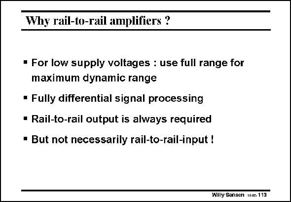

# SANSEN-113 · Why rail-to-rail amplifiers ?

章节：11 轨到轨输入与输出放大器  
PDF 页：295；书本页：302；幻灯片编号：113  
状态：unreviewed



## 对应教材讲解

### PDF 295 · 书本 302

The first reason to require a rail-to-rail input range is to be able to maintain the same Signal-to-Noise ratio for smaller supply voltages. Indeed signal swings decrease with the supply voltage. A rail-to-rail swing at the input is the highest that can be obtained. For maximum output swing, a fully-differential operation is a must as well. At the output, it is easy to provide a rail-to-rail swing. We simply take two output transistors Drain to Drain. For a capacitive load, rail-to-rail is guaranteed. At the input, however, we do not need rail-to-rail operation.

## 公式／性能结论候选摘录

以下为规则截取的原文，尚未逐项判读。

- PDF 295: Indeed signal swings decrease with the supply voltage.

## 曲线结论候选摘录

以下为规则截取的原文，尚未逐项判读。

（未由规则找到；不代表原页没有此类内容。）

## 原文条件与近似候选摘录

以下为规则截取的原文，尚未逐项判读。

（未由规则找到；不代表原页没有此类内容。）

## 幻灯片 OCR（未校正）

```text
Why rail-to-rail amplifiers ?
• For low supply voltages : use full range for
maximum dynamic range
• Fully differential signal processing
• Rail-to-rail output is always required
• But not necessarily rail-to-rail-input !
Willy Sansen 11.6 113
```

数学上下标、分数及正负号以原图为准。电路图已保留；未核对的连接不输出成可仿真 netlist。
