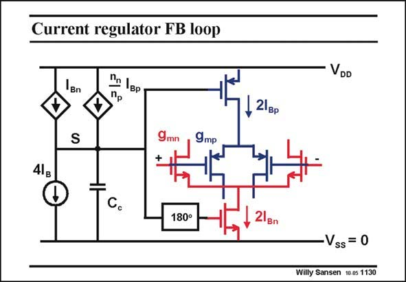

# SANSEN-1130 · Current regulator FB loop

章节：11 轨到轨输入与输出放大器  
PDF 页：308；书本页：315；幻灯片编号：1130  
状态：unreviewed



## 对应教材讲解

### PDF 308 · 书本 315

A very different approach is to use a current feedback loop, provided the transistors operate in weak inversion In the example in this slide, the total current is measured in the pMOST input pair and mirrored to current generator I . Also, Bp the total current is measured in the nMOST input pair and mirrored to current generator I . Both are Bn summed after correction of the I current for the n Bp factor in summation point S and compared to the reference current 4I . B If the sum of the currents does not correspond to 4I , the gates of the current sources have B to be adjusted. If the Gate of the pMOST current source must go up, then the Gate of the nMOST current source must go down. This is why there is an inverter before its Gate. Clearly this is a common-mode feedback loop. It must therefore be made stable. However, compensation capacitance cannot be too large. The common-mode feedback loop must be as fast as the differential circuit! This is explained in Chapter 8. How can we measure the total current in each input pair?

## 公式／性能结论候选摘录

以下为规则截取的原文，尚未逐项判读。

- PDF 308: It must therefore be made stable.

## 曲线结论候选摘录

以下为规则截取的原文，尚未逐项判读。

（未由规则找到；不代表原页没有此类内容。）

## 原文条件与近似候选摘录

以下为规则截取的原文，尚未逐项判读。

- PDF 308: A very different approach is to use a current feedback loop, provided the transistors operate in weak inversion In the example in this slide, the total current is measured in the pMOST input pair and mirrored to current generator I .

## 幻灯片 OCR（未校正）

```text
Current regulator FB loop
Bn
1вp
Пр
S
9mр
+
41g
180°
VDD
- 21gр
21gn
Vss = 0
Willy Sansen 10.0s 1130
```

数学上下标、分数及正负号以原图为准。电路图已保留；未核对的连接不输出成可仿真 netlist。
