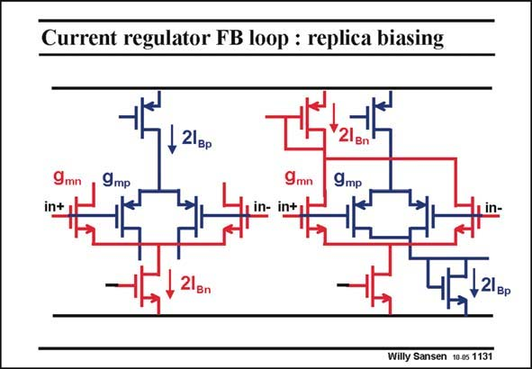

# SANSEN-1131 · Current regulator FB loop : replica biasing

章节：11 轨到轨输入与输出放大器  
PDF 页：309；书本页：316；幻灯片编号：1131  
状态：unreviewed



## 对应教材讲解

### PDF 309 · 书本 316

The feedback loop acts on a replica of the input stage. The input stage is copied, with the same transistor sizes and currents. The corresponding inputs are connected. The outputs of the replicas are shorted to cancel out the differential signals. In this way, the total current is measured in such a pair, regardless of whether it is on, off or halfway. The averaged outputs now lead to current mirrors to be summed towards point S. Replica is an ideal way to bias transistors without actually contacting the sensitive nodes, and without feedback. A few more examples are given.

## 公式／性能结论候选摘录

以下为规则截取的原文，尚未逐项判读。

（未由规则找到；不代表原页没有此类内容。）

## 曲线结论候选摘录

以下为规则截取的原文，尚未逐项判读。

（未由规则找到；不代表原页没有此类内容。）

## 原文条件与近似候选摘录

以下为规则截取的原文，尚未逐项判读。

（未由规则找到；不代表原页没有此类内容。）

## 幻灯片 OCR（未校正）

```text
Current regulator FB loop : replica biasing
, 21вр
9 mр
9mр
,21вр
Willy Sansen 10-05 1131
```

数学上下标、分数及正负号以原图为准。电路图已保留；未核对的连接不输出成可仿真 netlist。
