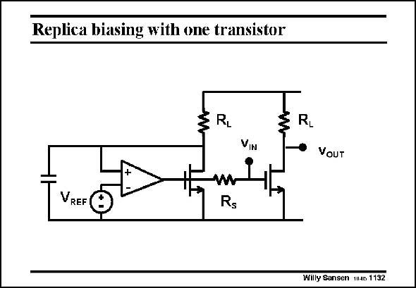

# SANSEN-1132 · Replica biasing with one transistor

章节：11 轨到轨输入与输出放大器  
PDF 页：309；书本页：316；幻灯片编号：1132  
状态：unreviewed



## 对应教材讲解

### PDF 309 · 书本 316

This circuit contains mainly one single-transistor amplifier. How can we set the average output voltage without feedback on this transistor? The answer is replica biasing. A transistor with the same characteristics is put in parallel. This one is now part of a feedback loop. Its DC output voltage will be V . The average output REF voltage of the amplifier itself will also be V . REF The DC output voltage will not be exactly V of course, because some mismatch is always REF present. The capacitance is required to reduce the influence of the AC voltage on the biasing. The resistor R is to raise the AC input impedance of the amplifier. S

## 公式／性能结论候选摘录

以下为规则截取的原文，尚未逐项判读。

（未由规则找到；不代表原页没有此类内容。）

## 曲线结论候选摘录

以下为规则截取的原文，尚未逐项判读。

- PDF 309: A transistor with the same characteristics is put in parallel.

## 原文条件与近似候选摘录

以下为规则截取的原文，尚未逐项判读。

（未由规则找到；不代表原页没有此类内容。）

## 幻灯片 OCR（未校正）

```text
Replica biasing with one transistor
RL
R1
VIN
VOUT
VREF
w
Rs
Willy Sansen 11J6 1132
```

数学上下标、分数及正负号以原图为准。电路图已保留；未核对的连接不输出成可仿真 netlist。
