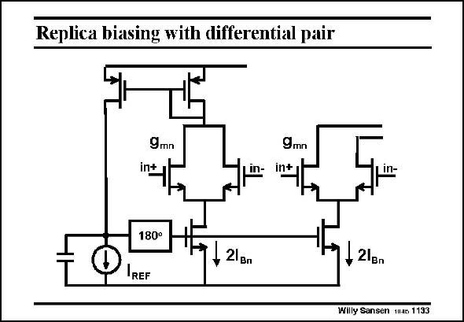

# SANSEN-1133 · Replica biasing with differential pair

章节：11 轨到轨输入与输出放大器  
PDF 页：310；书本页：317；幻灯片编号：1133  
状态：unreviewed



## 对应教材讲解

### PDF 310 · 书本 317

Another example of replica biasing is given in this slide. It is much closer to the railto-rail amplifier discussed earlier. The input pair is doubled. They share the voltage at the Gates of their DC current sources. The left pair however is included in a feedback loop, which ensures that the current equals I . REF Again, a capacitor is required to stabilize the common-mode feedback loop.

## 公式／性能结论候选摘录

以下为规则截取的原文，尚未逐项判读。

- PDF 310: The left pair however is included in a feedback loop, which ensures that the current equals I .

## 曲线结论候选摘录

以下为规则截取的原文，尚未逐项判读。

（未由规则找到；不代表原页没有此类内容。）

## 原文条件与近似候选摘录

以下为规则截取的原文，尚未逐项判读。

（未由规则找到；不代表原页没有此类内容。）

## 幻灯片 OCR（未校正）

```text
Replica biasing with differential pair
9mn
int
In-
9mn
in+
180°
REF
+ 21 Bn
• 21вn
Willy Sansen 11a6 1133
```

数学上下标、分数及正负号以原图为准。电路图已保留；未核对的连接不输出成可仿真 netlist。
