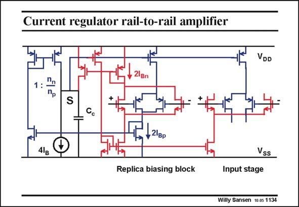

# SANSEN-1134 · Current regulator rail-to-rail amplifier

章节：11 轨到轨输入与输出放大器  
PDF 页：310；书本页：317；幻灯片编号：1134  
状态：unreviewed



## 对应教材讲解

### PDF 310 · 书本 317

A similar replica biasing is used in this rail-to-rail input stage. Both input pairs have a replica stage, the outputs of which are shorted and fed to the Summation point by means of current mirrors. At this point, the summed currents are compared to the reference current 4I . B This point directly drives the Gates of the pMOST current sources. An inverter is required however to drive the Gates of the nMOST current sources. The correction of the n factor is applied to the pMOST current mirror on the left.

## 公式／性能结论候选摘录

以下为规则截取的原文，尚未逐项判读。

（未由规则找到；不代表原页没有此类内容。）

## 曲线结论候选摘录

以下为规则截取的原文，尚未逐项判读。

（未由规则找到；不代表原页没有此类内容。）

## 原文条件与近似候选摘录

以下为规则截取的原文，尚未逐项判读。

（未由规则找到；不代表原页没有此类内容。）

## 幻灯片 OCR（未校正）

```text
Current regulator rail-to-rail amplifier
VDD
21Bn
1: 1
Пр
S
+ 21вр
41g
Vss
Replica biasing block
Input stage
Willy Sansen 10-05 1134
```

数学上下标、分数及正负号以原图为准。电路图已保留；未核对的连接不输出成可仿真 netlist。
