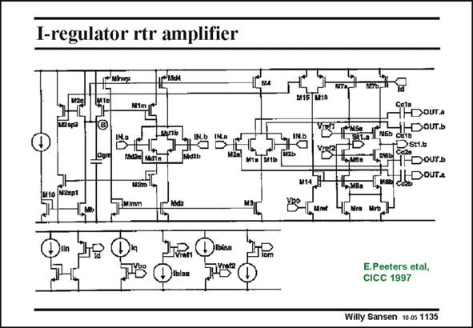

# SANSEN-1135 · I-regulator rtr amplifier

章节：11 轨到轨输入与输出放大器  
PDF 页：311；书本页：318；幻灯片编号：1135  
状态：unreviewed



## 对应教材讲解

### PDF 311 · 书本 318

The total first stage of this amplifier is given in this slide. The cascodes transistors of the two folded cascodes are easily recognized. Transistors Mra and Mrb provide common-mode feedback to the differential outputs. The four capacitances are Miller compensation capacitances, as shown next.

## 公式／性能结论候选摘录

以下为规则截取的原文，尚未逐项判读。

（未由规则找到；不代表原页没有此类内容。）

## 曲线结论候选摘录

以下为规则截取的原文，尚未逐项判读。

（未由规则找到；不代表原页没有此类内容。）

## 原文条件与近似候选摘录

以下为规则截取的原文，尚未逐项判读。

（未由规则找到；不代表原页没有此类内容。）

## 幻灯片 OCR（未校正）

```text
I-regulator rtr amplifier
thre
м2 sра
Cgml
iHDouTa
dDOUT.Ь
St1.b
Dourь
CoDOUTA
NZipl
Mret
Mra Mrb
E.Peeters etal,
CICC 1997
Willy Sansen 10.05 1135
```

数学上下标、分数及正负号以原图为准。电路图已保留；未核对的连接不输出成可仿真 netlist。
