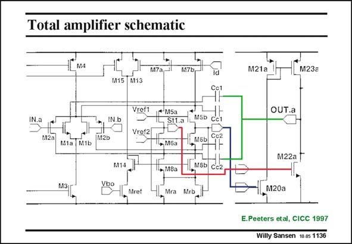

# SANSEN-1136 · Total amplifier schematic

章节：11 轨到轨输入与输出放大器  
PDF 页：311；书本页：318；幻灯片编号：1136  
状态：unreviewed



## 对应教材讲解

### PDF 311 · 书本 318

One of the two output stages is shown, together with the first-stage folded cascodes, without the replica biasing. The two second-stage transistors lead to the output. From the output two compensation capacitances lead to the output of the first stage through both cascodes. Two capacitors are needed because only one of the cascodes may be operational at one of the extremities.

## 公式／性能结论候选摘录

以下为规则截取的原文，尚未逐项判读。

（未由规则找到；不代表原页没有此类内容。）

## 曲线结论候选摘录

以下为规则截取的原文，尚未逐项判读。

（未由规则找到；不代表原页没有此类内容。）

## 原文条件与近似候选摘录

以下为规则截取的原文，尚未逐项判读。

（未由规则找到；不代表原页没有此类内容。）

## 幻灯片 OCR（未校正）

```text
Total amplifier schematic
1Lмa
M7a
M7Ь
M15
M13
Vref1
IN.a
IN.b
*MSa
Stl.a
Vref2
M2a
M1a M1b
M2b
M5D CCl
МБЬ
Cc2
• Мба
M14
M3
VBo
, Мва
Mret
4nMra Mrot
,NGD CE2
M21a
M23al
OUT.a
M22a П
*1,м20а
E.Peeters etal, CICC 1997
Willy Sansen 10 0s 1136
```

数学上下标、分数及正负号以原图为准。电路图已保留；未核对的连接不输出成可仿真 netlist。
