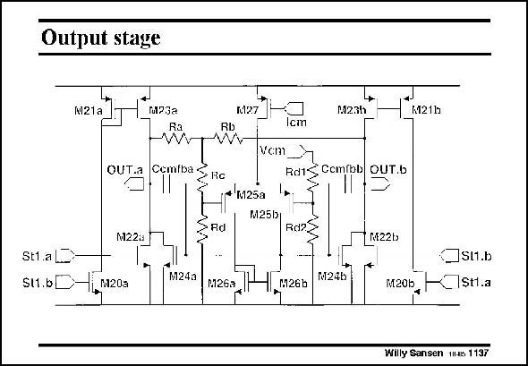

# SANSEN-1137 · Output stage

章节：11 轨到轨输入与输出放大器  
PDF 页：312；书本页：319；幻灯片编号：1137  
状态：unreviewed



## 对应教材讲解

### PDF 312 · 书本 319

The full second stage or output stage is given in this slide. The output stage of the previous slide is now repeated twice, once with transistors M20a-M23a and once with transistors M20b- M23b. The output stage is also differential. As a result, another common-mode feedback (CMFB) amplifier is required. The output is averaged with resistors Ra and Rb. The CMFB amplifier can take many different configurations (see Chapter 8). This is only one of them.

## 公式／性能结论候选摘录

以下为规则截取的原文，尚未逐项判读。

- PDF 312: As a result, another common-mode feedback (CMFB) amplifier is required.

## 曲线结论候选摘录

以下为规则截取的原文，尚未逐项判读。

（未由规则找到；不代表原页没有此类内容。）

## 原文条件与近似候选摘录

以下为规则截取的原文，尚未逐项判读。

（未由规则找到；不代表原页没有此类内容。）

## 幻灯片 OCR（未校正）

```text
Output stage
N21a
M123a
Ra
M1?7
Rb
OUTa Cemiba SHa
+ M25a
M25b
M22a
SRd
M23h
k121b
cm
RdiS Ccmibb OUT.b
M22b
St1.aL
S11.b
Hi M20a
M24a
N24b
M26a
_JSI1.b
Stl.a
„M26b
11200, г
Willy Sansen aes 1137
```

数学上下标、分数及正负号以原图为准。电路图已保留；未核对的连接不输出成可仿真 netlist。
