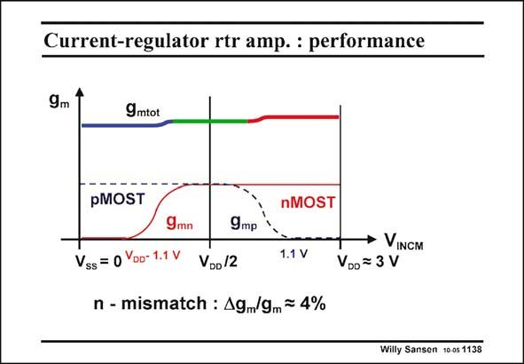

# SANSEN-1138 · Current-regulator rtr amp.: performance

章节：11 轨到轨输入与输出放大器  
PDF 页：312；书本页：319；幻灯片编号：1138  
状态：unreviewed



## 对应教材讲解

### PDF 312 · 书本 319

The g equalization works m quite well. The error of 4% is due to the mismatch in n factor. The supply voltage used here is quite large. It can be reduced to about 2.2 V if we want to have both pairs on at the same time. Is this required? The answer is negative as shown next.

## 公式／性能结论候选摘录

以下为规则截取的原文，尚未逐项判读。

- PDF 312: The g equalization works m quite well.

## 曲线结论候选摘录

以下为规则截取的原文，尚未逐项判读。

（未由规则找到；不代表原页没有此类内容。）

## 原文条件与近似候选摘录

以下为规则截取的原文，尚未逐项判读。

（未由规则找到；不代表原页没有此类内容。）

## 幻灯片 OCR（未校正）

```text
Current-regulator rtr amp.: performance
9m
9mtot
pMOST
9mn
9mр
Vss= 0 Yoo- 1.1 V
VDo12
nMOST
1.1 V
n - mismatch : Agm/gm = 4%
• VINCM
VDo= 3 V
Willy Sansen 10 o5 1138
```

数学上下标、分数及正负号以原图为准。电路图已保留；未核对的连接不输出成可仿真 netlist。
