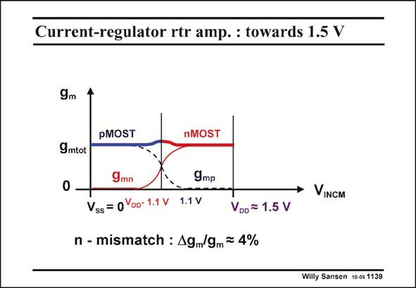

# SANSEN-1139 · Current-regulator rtr amp. : towards 1.5 V

章节：11 轨到轨输入与输出放大器  
PDF 页：313；书本页：320；幻灯片编号：1139  
状态：unreviewed



## 对应教材讲解

### PDF 313 · 书本 320

There is no need to have an input range where both input pairs are on. The supply voltage could be reduced to the point where a perfect crossover is achieved. This means that the pMOST pairs goes off exactly at the point where the nMOST pair comes up. This cross-over point is exactly at halfway the supply voltage for the average input. Also, this point is exactly where the g ’s are halved. As a result, m there is no more sum to be taken, except around the middle of the input range. The total transconductance equals the transconductance of one pair taken only at the extremities. The resultant supply voltage is 1.5 V in this design example. This is set experimentally of course. This voltage is now twice V +V . This is V +2(V −V ). For operation in weak GS DSsat T GS T inversion V −V =50 mV has been taken. The values of V must therefore have been 0.65 V. GS T T For V values of 0.3 V, this rail-to-rail opamp would operate on a supply voltage of 0.8 V. T This is below 1 V! However, it is impossible to set this supply voltage beforehand, as it depends on the absolute value of V . Some tolerance must be added to this value. For V values of 0.3 V, this rail-to-rail T T opamp can certainly operate on a supply voltage below 1 V!

## 公式／性能结论候选摘录

以下为规则截取的原文，尚未逐项判读。

- PDF 313: As a result, m there is no more sum to be taken, except around the middle of the input range.
- PDF 313: The total transconductance equals the transconductance of one pair taken only at the extremities.
- PDF 313: The values of V must therefore have been 0.65 V.
- PDF 313: However, it is impossible to set this supply voltage beforehand, as it depends on the absolute value of V .

## 曲线结论候选摘录

以下为规则截取的原文，尚未逐项判读。

（未由规则找到；不代表原页没有此类内容。）

## 原文条件与近似候选摘录

以下为规则截取的原文，尚未逐项判读。

（未由规则找到；不代表原页没有此类内容。）

## 幻灯片 OCR（未校正）

```text
Current-regulator rtr amp. : towards 1.5 V
9m
9mtot
0
pMOST
nMOST
9mn
Vss = 0Yoo- 1.1 V
9mp
1.1 V
n - mismatch : Ag/9m = 4%
VINCM
VDD = 1.5 V
Willy Sansen 10 05 1139
```

数学上下标、分数及正负号以原图为准。电路图已保留；未核对的连接不输出成可仿真 netlist。
