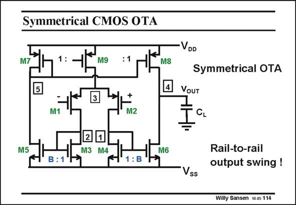

# SANSEN-114 · Symmetrical CMOS OTA

章节：11 轨到轨输入与输出放大器  
PDF 页：295；书本页：302；幻灯片编号：114  
状态：unreviewed



## 对应教材讲解

### PDF 295 · 书本 302

To illustrate this last point, let us take this well known symmetrical opamp. For a capacitive load, it is obvious that the output can reach rail-to-rail output voltages. At the extremities, the output transistor goes into the linear region and the gain is reduced leading to distortion. It is still railto-rail, however. At the input, it is clear that a voltage is lost of V +V for the input GS1 DSsat9 range, which is rather large. Some other circuitry is now required. Is this always required?

## 公式／性能结论候选摘录

以下为规则截取的原文，尚未逐项判读。

- PDF 295: At the extremities, the output transistor goes into the linear region and the gain is reduced leading to distortion.

## 曲线结论候选摘录

以下为规则截取的原文，尚未逐项判读。

（未由规则找到；不代表原页没有此类内容。）

## 原文条件与近似候选摘录

以下为规则截取的原文，尚未逐项判读。

（未由规则找到；不代表原页没有此类内容。）

## 幻灯片 OCR（未校正）

```text
Symmetrical CMOS OTA
M7
M9
M8
4
-VDD
VOUT
M1
+
M2
Symmetrical OTA
CL
M5
M3 M4
M6
В :1
1 :B
Rail-to-rail
output swing !
Vss
Willy Sansen 10-05 114
```

数学上下标、分数及正负号以原图为准。电路图已保留；未核对的连接不输出成可仿真 netlist。
