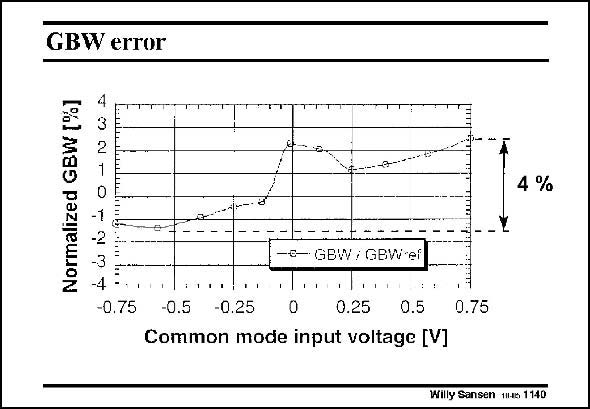

# SANSEN-1140 · GBW error

章节：11 轨到轨输入与输出放大器  
PDF 页：313；书本页：320；幻灯片编号：1140  
状态：unreviewed



## 对应教材讲解

### PDF 313 · 书本 320

The error in transconductance is obviously reflected in the error on the GBW. This has been measured as shown in this slide. From left to right, the total deviation is 4% or maybe better ±2%. The supply voltage is only 1.5 V.

## 公式／性能结论候选摘录

以下为规则截取的原文，尚未逐项判读。

（未由规则找到；不代表原页没有此类内容。）

## 曲线结论候选摘录

以下为规则截取的原文，尚未逐项判读。

（未由规则找到；不代表原页没有此类内容。）

## 原文条件与近似候选摘录

以下为规则截取的原文，尚未逐项判读。

（未由规则找到；不代表原页没有此类内容。）

## 幻灯片 OCR（未校正）

```text
GBW error
Normalized GBW [%]
LÜNTONGA
-0.75
-E- GBW / GBWref
-0.5
-0.25
0
0.25
0.5
Common mode input voltage V]
4 %
0.75
Willy Sansen 1146 1140
```

数学上下标、分数及正负号以原图为准。电路图已保留；未核对的连接不输出成可仿真 netlist。
