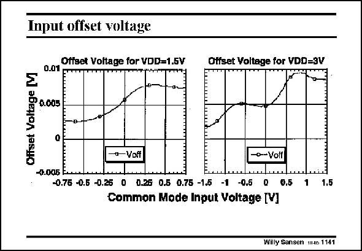

# SANSEN-1141 · Input ofiset voltage

章节：11 轨到轨输入与输出放大器  
PDF 页：314；书本页：321；幻灯片编号：1141  
状态：unreviewed



## 对应教材讲解

### PDF 314 · 书本 321

However, the variation in g m or GBW is not the biggest problem. The biggest problem is the change in offset voltage from left to right. Going from low to high common-mode input voltages, a different input pair is operational, pMOST on the left but nMOST on the right. These pairs usually have different offset voltages. This change in offset voltage gives a lot of distortion. For a supply voltage of 1.5 V, the difference is about 5 mV. This can be regarded as an error signal (for example 1 V). The distortion can be as high as 0.5% or −50 dB. This is too much for most applications! In bipolar technologies, this offset can be ten times smaller. The distortion is also ten times smaller or −70 dB, which is much more acceptable. For a supply voltage of 3 V, the offset is averaged out in the middle. The distortion remains however.

## 公式／性能结论候选摘录

以下为规则截取的原文，尚未逐项判读。

（未由规则找到；不代表原页没有此类内容。）

## 曲线结论候选摘录

以下为规则截取的原文，尚未逐项判读。

（未由规则找到；不代表原页没有此类内容。）

## 原文条件与近似候选摘录

以下为规则截取的原文，尚未逐项判读。

（未由规则找到；不代表原页没有此类内容。）

## 幻灯片 OCR（未校正）

```text
Input ofiset voltage
o.ay pffset Voltage for VDD=1.5V
ТТТТЕНіНц
Otfset Voltage for VDD=3V
Offset Voltage |
0.003
-7.005 E.
- Voff
-0-Votf
-0.75 -0.5 -0.25 0 0.25 0.5 0.75 -15 -1 -0.5 0 0,5 1
1.5
Common Mode Input Voltage [V]
Willy Sansen 1145 1141
```

数学上下标、分数及正负号以原图为准。电路图已保留；未核对的连接不输出成可仿真 netlist。
