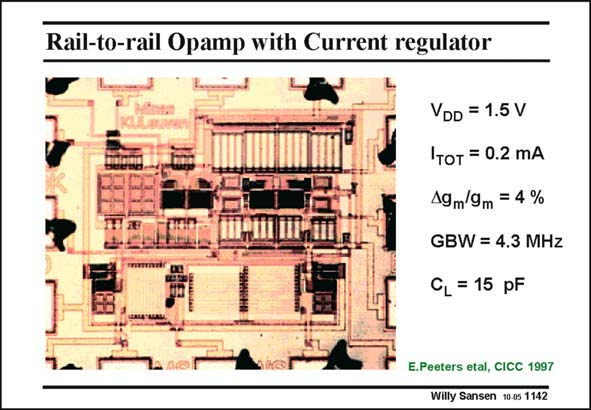

# SANSEN-1142 · Rail-to-rail Opamp with Current regulator

章节：11 轨到轨输入与输出放大器  
PDF 页：314；书本页：321；幻灯片编号：1142  
状态：unreviewed



## 对应教材讲解

### PDF 314 · 书本 321

This layout is shown that most input stage devices are quite big. Indeed, they are used in weak inversion, which leads to large W/L ratios. The specifications are added as well. They show a FOM of about 320 MHzpF/ mA, which is very reasonable indeed. This shows that a replica input stage does not add all that much to the power consumption. After all, the current consumption in the first stage of a two-stage opamp is always small. Doubling it is not going to make a big difference in total power consumption.

## 公式／性能结论候选摘录

以下为规则截取的原文，尚未逐项判读。

（未由规则找到；不代表原页没有此类内容。）

## 曲线结论候选摘录

以下为规则截取的原文，尚未逐项判读。

（未由规则找到；不代表原页没有此类内容。）

## 原文条件与近似候选摘录

以下为规则截取的原文，尚未逐项判读。

（未由规则找到；不代表原页没有此类内容。）

## 幻灯片 OCR（未校正）

```text
Rail-to-rail Opamp with Current regulator
VDD = 1.5 V
'тот = 0.2 mA
A9 m/9m = 4 %
GBW = 4.3 MHz
CL = 15 pF
E.Peeters etal, CICC 1997
Willy Sansen 10-05 1142
```

数学上下标、分数及正负号以原图为准。电路图已保留；未核对的连接不输出成可仿真 netlist。
