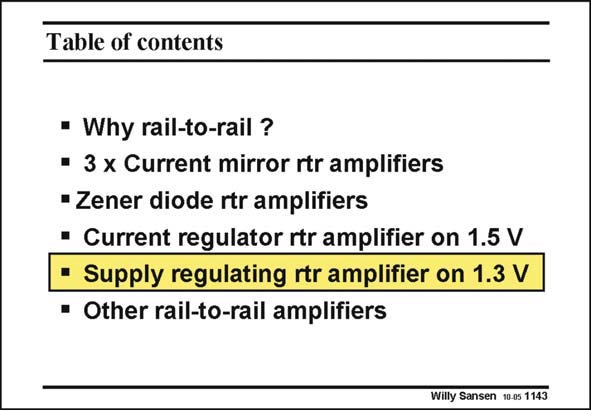

# SANSEN-1143 · Table of contents

章节：11 轨到轨输入与输出放大器  
PDF 页：315；书本页：322；幻灯片编号：1143  
状态：unreviewed



## 对应教材讲解

### PDF 315 · 书本 322

The previous rail-to-rail amplifier had the advantage that the supply voltage can be as low as 1.5 V but had at the same time the disadvantage that this supply voltage is hard to predict. In the next rail-to-rail amplifier an internal supply voltage is derived from the external one, which is always set at the minimum possible supply voltage. An exact cross-over situation is always maintained. In this way, a minimum supply voltage is reached which is barely 1.3 V. Moreover, the PSRR is greatly improved as well.

## 公式／性能结论候选摘录

以下为规则截取的原文，尚未逐项判读。

（未由规则找到；不代表原页没有此类内容。）

## 曲线结论候选摘录

以下为规则截取的原文，尚未逐项判读。

（未由规则找到；不代表原页没有此类内容。）

## 原文条件与近似候选摘录

以下为规则截取的原文，尚未逐项判读。

（未由规则找到；不代表原页没有此类内容。）

## 幻灯片 OCR（未校正）

```text
Table of contents
• Why rail-to-rail ?
• 3 x Current mirror rtr amplifiers
• Zener diode rtr amplifiers
• Current regulator rtr amplifier on 1.5 V
• Supply regulating rtr amplifier on 1.3 V
• Other rail-to-rail amplifiers
Willy Sansen 10.05 1143
```

数学上下标、分数及正负号以原图为准。电路图已保留；未核对的连接不输出成可仿真 netlist。
