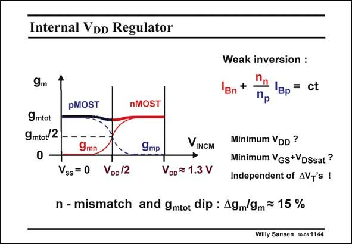

# SANSEN-1144 · Internal Voo Regulator

章节：11 轨到轨输入与输出放大器  
PDF 页：315；书本页：322；幻灯片编号：1144  
状态：unreviewed



## 对应教材讲解

### PDF 315 · 书本 322

The internal supply voltage V will be such that the DD exact cross-over condition is always maintained automatically. This means that at half this supply voltage V /2, the g ’s of both pairs DD m are reduced to half. In this way the sum is unity over the whole common-mode input range. This internal supply voltage will now be a result of two feedback loops. The first one has a task to maintain the same current in both pairs. It will therefore be a current feedback which ensures equality of the currents and hence of the transconductances. The second feedback loop will be a low dropout voltage regulator which maintains the minimum possible internal supply voltage V . It will always equal the sum of the V +V DD GS DSsat voltages of both pairs at half the current, or half the transconductance. Whatever the V ’s are, the minimum internal supply voltage is always guaranteed, providing T a constant g . m

## 公式／性能结论候选摘录

以下为规则截取的原文，尚未逐项判读。

- PDF 315: It will therefore be a current feedback which ensures equality of the currents and hence of the transconductances.
- PDF 315: It will always equal the sum of the V +V DD GS DSsat voltages of both pairs at half the current, or half the transconductance.

## 曲线结论候选摘录

以下为规则截取的原文，尚未逐项判读。

（未由规则找到；不代表原页没有此类内容。）

## 原文条件与近似候选摘录

以下为规则截取的原文，尚未逐项判读。

（未由规则找到；不代表原页没有此类内容。）

## 幻灯片 OCR（未校正）

```text
Internal Voo Regulator
9m
gmtot
9mtot/2
pMOST
nMOST
Weak inversion :
+
'Bn
Bp= ct
Пр
9mn
9mp
VINGM
Vss = 0
VDo/2
VDo = 1.3 V
Minimum VDD ?
Minimum Vgs+VDSsat?
Independent of AVT's !
n - mismatch and gmtot dip : 49m/9m= 15 %
Willy Sansen 10 0s 1144
```

数学上下标、分数及正负号以原图为准。电路图已保留；未核对的连接不输出成可仿真 netlist。
