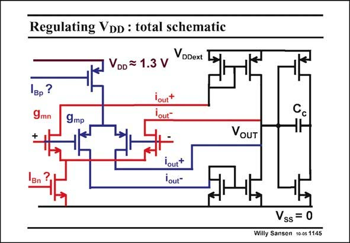

# SANSEN-1145 · Regulating VDD : total schematic

章节：11 轨到轨输入与输出放大器  
PDF 页：316；书本页：323；幻灯片编号：1145  
状态：unreviewed



## 对应教材讲解

### PDF 316 · 书本 323

The rail-to-rail opamp is a simple double input stage. Not even cascodes are used. The four outputs of the two input pairs are combined towards one single output node in the simplest possible way. This can be improved greatly. However, the focus is on the rail-to-rail performance of the input stage. A second stage is added to drive the measurement system. The two supply voltage are clearly separated. The internal supply voltage V will be derived from the external one V . DD DDext

## 公式／性能结论候选摘录

以下为规则截取的原文，尚未逐项判读。

（未由规则找到；不代表原页没有此类内容。）

## 曲线结论候选摘录

以下为规则截取的原文，尚未逐项判读。

（未由规则找到；不代表原页没有此类内容。）

## 原文条件与近似候选摘录

以下为规则截取的原文，尚未逐项判读。

（未由规则找到；不代表原页没有此类内容。）

## 幻灯片 OCR（未校正）

```text
Regulating VDD : total schematic
VDDext
VDD = 1.3 V
вp?
9mn
9mp
VoUT
Bn
lout+
lout"
Vss = 0
Willy Sansen 10 05 1145
```

数学上下标、分数及正负号以原图为准。电路图已保留；未核对的连接不输出成可仿真 netlist。
