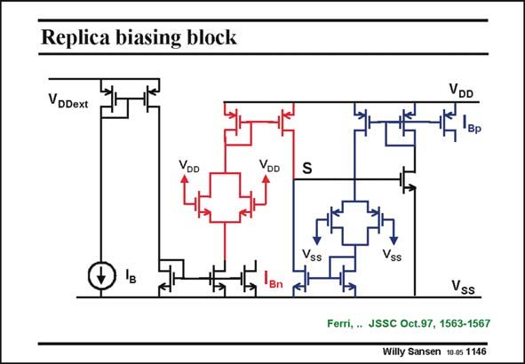

# SANSEN-1146 · Replica biasing block

章节：11 轨到轨输入与输出放大器  
PDF 页：316；书本页：323；幻灯片编号：1146  
状态：unreviewed



## 对应教材讲解

### PDF 316 · 书本 323

The first feedback has a task of maintaining the same current in both pairs. It is the current feedback which ensures equality of the currents, whatever happens to the transistors. The independent biasing is provided by current source I . The same current B also flows in the nMOST differential pair. This pair is a replica of the nMOST pair used in the amplifier itself. However, the input Gates are connected to the positive supply V . DD Its average current is measured and compared to the average current of the pMOST pair, the Gates of which are connected to the negative supply V (or ground). SS The point of comparison, point S, is fed back to a current mirror which closes the feedback loop. This circuit already provides the Gate drives for the nMOST and the pMOST current sources in the actual amplifier. They are labeled by I and I . Bn Bp

## 公式／性能结论候选摘录

以下为规则截取的原文，尚未逐项判读。

- PDF 316: It is the current feedback which ensures equality of the currents, whatever happens to the transistors.
- PDF 316: The independent biasing is provided by current source I .

## 曲线结论候选摘录

以下为规则截取的原文，尚未逐项判读。

（未由规则找到；不代表原页没有此类内容。）

## 原文条件与近似候选摘录

以下为规则截取的原文，尚未逐项判读。

- PDF 316: The independent biasing is provided by current source I .

## 幻灯片 OCR（未校正）

```text
Replica biasing block
VDDext
VoD
VDD
S
VDD
Bp
Vss
Vss
Ferri, . JSSC Oct.97, 1563-1567
Willy Sansen 10 0s 1146
```

数学上下标、分数及正负号以原图为准。电路图已保留；未核对的连接不输出成可仿真 netlist。
