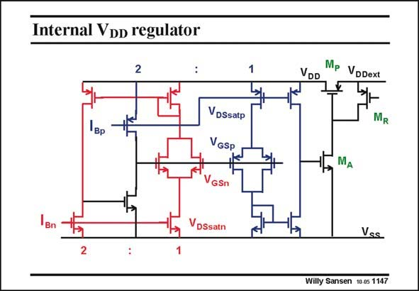

# SANSEN-1147 · Internal VoD regulator

章节：11 轨到轨输入与输出放大器  
PDF 页：317；书本页：324；幻灯片编号：1147  
状态：unreviewed



## 对应教材讲解

### PDF 317 · 书本 324

The other feedback loop is a low-dropout voltage regulator which maintains the minimum possible internal supply voltage V . It must DD equal the sum of the V +V voltages of both GS DSsat pairs at half the current. The pass transistor M is driven P by amplifier M /M . This A R latter transistor acts as a resistive load. The half current sources are now generated first. The factors of 2 are clearly visible. Moreover, the input pairs are duplicated once more, with their four Gates connected together. A voltage regulator feedback circuit is added on the right, such that voltage V always equals DD the sum of the voltages V +V and the V +V . DSsatp GSp GSn DSsatn

## 公式／性能结论候选摘录

以下为规则截取的原文，尚未逐项判读。

- PDF 317: It must DD equal the sum of the V +V voltages of both GS DSsat pairs at half the current.
- PDF 317: A voltage regulator feedback circuit is added on the right, such that voltage V always equals DD the sum of the voltages V +V and the V +V .

## 曲线结论候选摘录

以下为规则截取的原文，尚未逐项判读。

（未由规则找到；不代表原页没有此类内容。）

## 原文条件与近似候选摘录

以下为规则截取的原文，尚未逐项判读。

（未由规则找到；不代表原页没有此类内容。）

## 幻灯片 OCR（未校正）

```text
Internal VoD regulator
1вp
VDSsatp
VGSP
VDD
Mp Vopext
H
MR
MA
Vss
Willy Sansen 10.05 1147
```

数学上下标、分数及正负号以原图为准。电路图已保留；未核对的连接不输出成可仿真 netlist。
