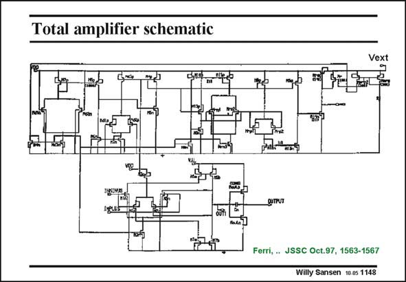

# SANSEN-1148 · Total amplifier schematic

章节：11 轨到轨输入与输出放大器  
PDF 页：317；书本页：324；幻灯片编号：1148  
状态：unreviewed



## 对应教材讲解

### PDF 317 · 书本 324

The whole amplifier is shown in this slide. The actual amplifier is at the lower end. The top part is the biasing circuitry. The input pairs have been duplicated twice. This adds a small amount to the power consumption, Since this is a two-stage amplifier however, the power consumption is not that bad, as will be shown in the comparative table at the end of this Chapter.

## 公式／性能结论候选摘录

以下为规则截取的原文，尚未逐项判读。

（未由规则找到；不代表原页没有此类内容。）

## 曲线结论候选摘录

以下为规则截取的原文，尚未逐项判读。

（未由规则找到；不代表原页没有此类内容。）

## 原文条件与近似候选摘录

以下为规则截取的原文，尚未逐项判读。

（未由规则找到；不代表原页没有此类内容。）

## 幻灯片 OCR（未校正）

```text
Total amplifier schematic
Vext
gUTPUT
Ferri, . JSSC Oct.97, 1563-1567
Willy Sansen 10.05 1148
```

数学上下标、分数及正负号以原图为准。电路图已保留；未核对的连接不输出成可仿真 netlist。
