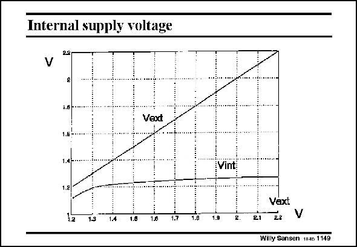

# SANSEN-1149 · Internal supply voltage

章节：11 轨到轨输入与输出放大器  
PDF 页：318；书本页：325；幻灯片编号：1149  
状态：unreviewed



## 对应教材讲解

### PDF 318 · 书本 325

The internal supply voltage V , is derived from the int external V , as shown by ext this measurement result. The value of about 1.2–1.3 V depends obviously on the actual values of V . They must be about T 100 mV lower than for the previous rail-to-rail amplifier. The minimum external supply voltage is little more than the internal one, about 100 mV higher. This means that this amplifier can be used with an external supply voltage from 1.3 V. The maximum external supply voltage is limited however. Folded cascodes can only go about 0.5 V above the positive supply voltage. The rail-to-rail performance is therefore limited to approximately 1.8 V.

## 公式／性能结论候选摘录

以下为规则截取的原文，尚未逐项判读。

- PDF 318: The value of about 1.2–1.3 V depends obviously on the actual values of V .
- PDF 318: The maximum external supply voltage is limited however.
- PDF 318: The rail-to-rail performance is therefore limited to approximately 1.8 V.

## 曲线结论候选摘录

以下为规则截取的原文，尚未逐项判读。

（未由规则找到；不代表原页没有此类内容。）

## 原文条件与近似候选摘录

以下为规则截取的原文，尚未逐项判读。

- PDF 318: The rail-to-rail performance is therefore limited to approximately 1.8 V.

## 幻灯片 OCR（未校正）

```text
Internal supply voltage
22
V
1.0--
Vext
1.6 -
1.4,
Vint
1.2
Vaxt
1a
13
14
1.8
1.6
1.7
1.0
1.8
21
V
Willy Sansen 1i-6 1149
```

数学上下标、分数及正负号以原图为准。电路图已保留；未核对的连接不输出成可仿真 netlist。
